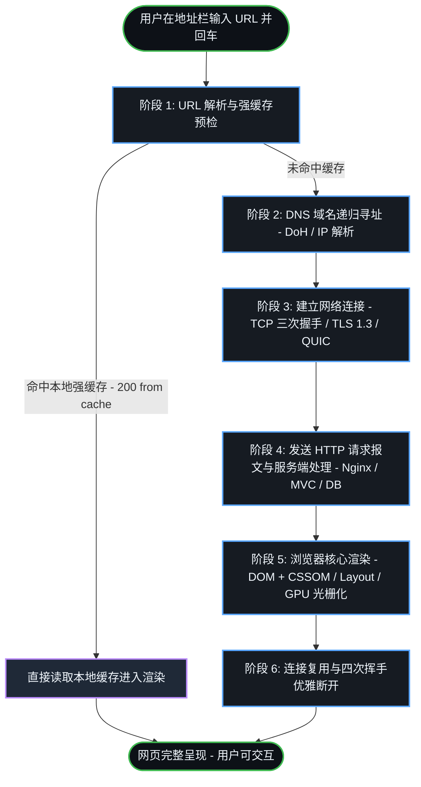
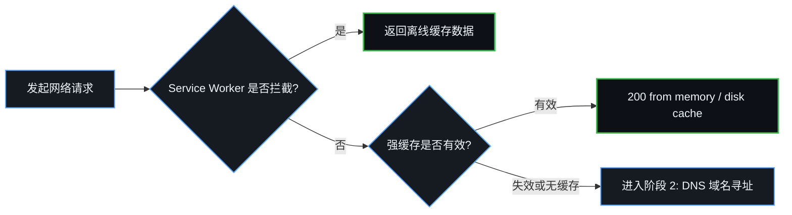
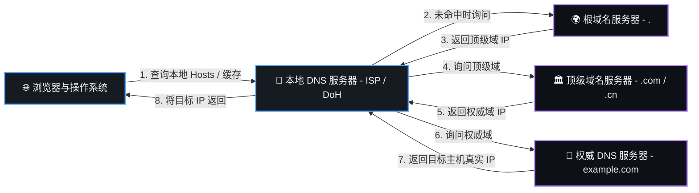
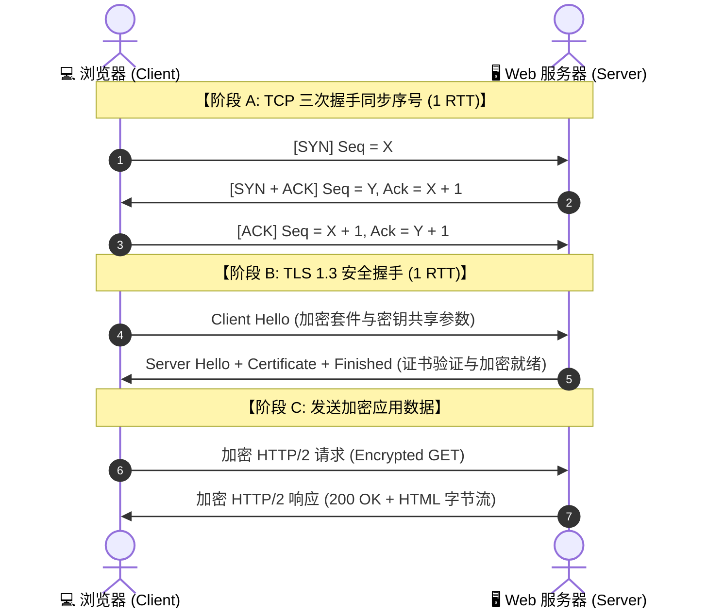
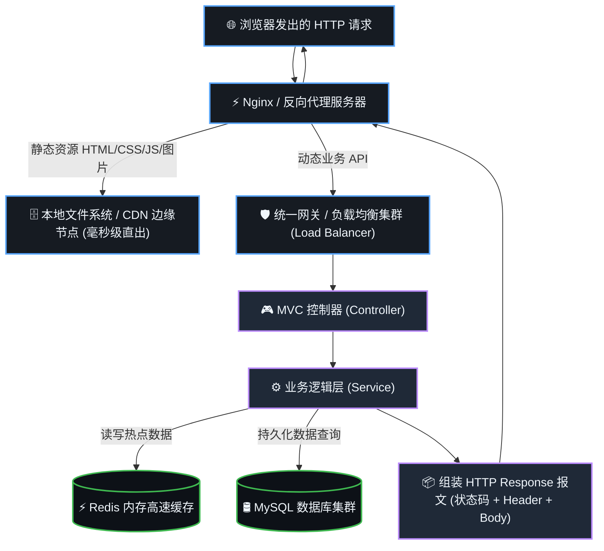
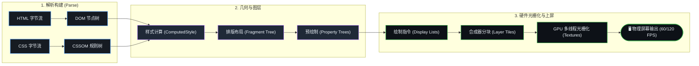
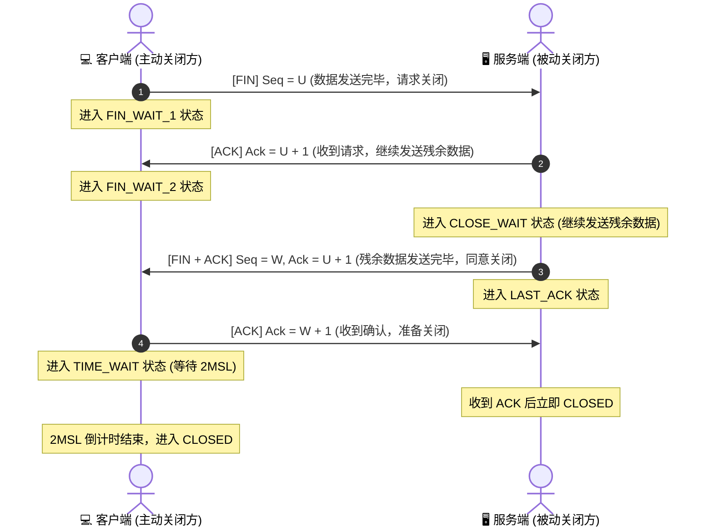

# 一文搞懂：从输入 URL 到页面呈现的完整全历程

在浏览器地址栏输入一个 URL 并按下回车，短短几百毫秒内，屏幕上就会呈现出图文并茂的网页。这背后其实是**计算机网络、操作系统、服务端分布式架构与现代浏览器渲染引擎**共同上演的一场精密交响乐。

本文将摒弃晦涩的生硬术语，采用**标准 Mermaid 架构图与时序图**，带你从宏观到微观走完这段精彩的“全链路数据之旅”。

---

## 🧭 全景宏观流程图

整个请求生命周期可以划分为清晰的 6 大核心阶段：



---

## 阶段 1：URL 解析与本地缓存预检

### 1.1 URL 的标准解构

URL（统一资源定位符）就像是互联网世界里的“精确门牌号”：

```
https://www.example.com:443/shop/item?id=1024#detail
└─┬─┘   └──────┬──────┘ └─┬─┘ └───┬───┘ └──┬──┘ └──┬───┘
 协议        主机域名     端口    路径     查询参数   哈希锚点
(Scheme)     (Domain)    (Port)  (Path)  (Query)  (Hash)
```

- **协议（Scheme）**：通信协议类型，如 `https`（TLS 加密传输）、`http`（明文）。
- **域名（Domain）**：服务器的人类可读助记符名称。
- **端口（Port）**：目标主机上接收网络服务的程序入口（HTTP 默认 `80`，HTTPS 默认 `443`）。
- **路径（Path）与参数（Query）**：指定服务器上的具体资源或接口参数。

### 1.2 本地强缓存命中检查

在真正向网卡发射任何网络数据包之前，浏览器会依序检查本地缓存策略：



---

## 阶段 2：DNS 域名解析（寻找目标主机的真实 IP）

计算机在底层网络通信中只能识别数字形式的 **IP 地址**（如 `185.199.108.153`），DNS（域名系统）承担了全球“电话号码簿”的角色。

### 2.1 递归与迭代查询链路

寻找 IP 的过程遵循“由近及远、逐级询问”的原则：



> **现代安全标准（DoH）**：传统 DNS 查询使用明文 UDP 协议，极易遭遇运营商 DNS 劫持与篡改。现代浏览器普遍开启了 **DNS over HTTPS (DoH)**，将 DNS 查询包裹在加密的 HTTPS 通道中，确保域名解析绝对安全。

---

## 阶段 3：建立安全传输连接（从 TCP 到 HTTP/3 QUIC）

获取到目标 IP 后，浏览器与服务器开始握手建立端到端的可靠通信信道。

### 3.1 经典模式：TCP 三次握手 + TLS 1.3 安全加密

在经典的 HTTP/1.1 与 HTTP/2 体系中，底层基于 TCP 传输协议。为了同步双方的初始序列号并确认双向收发能力，需要进行**三次握手**：



- **为什么握手必须是三次？**：防止网络中因为拥堵滞留的“过期旧连接请求”突然到达服务端，导致服务端单方面错误地分配资源建立死连接。
- **TLS 1.3 极速化**：相较于旧版 TLS 1.2 需要 2 个 RTT，现代 TLS 1.3 将协商轮次压缩至仅需 **1 个 RTT** 即可完成对称加密密钥的派生。

### 3.2 现代标准：HTTP/3（基于 QUIC 的 0-RTT / 1-RTT 连接）

在最新的 **HTTP/3** 中，传输层改用基于 UDP 的 **QUIC 协议**：
- **握手合并**：将传输握手与 TLS 1.3 安全握手一体化，冷启动首次连接仅需 1 个 RTT。
- **0-RTT 会话复用**：对于曾经访问过的站点，客户端在握手的第一个数据包中直接携带加密请求，实现真正的 **0-RTT 极速直连**。
- **彻底消除队头阻塞（Head-of-Line Blocking）**：各资源在独立的 Stream 中并行传输，单个数据包丢失仅阻塞自身流，不再影响整条连接。

---

## 阶段 4：发送 HTTP 请求与服务端架构处理

连接建立后，浏览器组装 HTTP 请求报文发送给服务端。



---

## 阶段 5：浏览器核心渲染流水线（从代码到屏幕像素）

当浏览器接收到 HTML 字节流时，渲染引擎（如 Chromium Blink / Safari WebKit）立即开启多线程流水线作业：



1. **流式 Token 解析**：HTML 解析器一边接收网络字节一边生成 DOM 树，遇到 `<script>` 时暂停解析，交由 JS 引擎执行。
2. **样式计算（Recalculate Style）**：将 CSS 选择器与 DOM 匹配，产出绝对像素级的 `ComputedStyle`。
3. **几何布局（Layout）**：计算各个可见元素的盒模型尺寸与在屏幕中的绝对坐标 $(x, y)$。
4. **生成绘制指令（Paint）**：生成各个图层的绘图指令列表（Display Lists）。
5. **GPU 合成与光栅化（Composite & Raster）**：合成器线程（Compositor Thread）将页面分块，调度 GPU 硬件加速光栅化为显存纹理，最终通过帧缓冲区在屏幕上逐帧呈现。

---

## 阶段 6：连接复用与优雅关闭

数据传输完毕后，现代网络协议如何管理底层连接？

1. **Keep-Alive 持续连接复用**：在现代 HTTP/1.1、HTTP/2 及 HTTP/3 中，默认保持连接处于存活状态。后续的子资源（如 CSS、JS、图片）会**复用同一条已建立的信道**，避免重复握手的延迟损耗。
2. **TCP 四次挥手（优雅释放）**：当通信双方需要彻底关闭通道时，触发四次挥手协议：



> **为什么需要四次挥手？**：因为 TCP 是全双工通信（双向独立）。一方发送 FIN 仅表示自己不再发送数据，但仍能接收数据；另一方必须在处理完未完数据后单独发送 FIN，因此确认与关闭动作必须分为两次往返。

---

## 🌟 核心知识点架构一览表

| 阶段 | 核心任务 | 现代演进与最佳工程实践 |
|---|---|---|
| **1. 输入与缓存** | URL 解析、检查 Service Worker 与 Disk 强缓存 | 静态资源带内容 Hash 强缓存 1 年，HTML 文件使用协商缓存 |
| **2. DNS 解析** | 将人类可读域名解析为机器 IP 地址 | 引入 **DNS over HTTPS (DoH)** 加密防劫持 |
| **3. 建立连接** | 建立双向可靠加密信道 | 演进为 **HTTP/3 QUIC (0-RTT/1-RTT)** 极速握手 |
| **4. 传输报文** | 客户端发 Request，服务端 Nginx/MVC 处理回传 Response | 采用 HTTP/2 / HTTP/3 多路复用 + 103 Early Hints |
| **5. 页面渲染** | DOM/CSSOM -> Layout -> GPU 光栅化合成上屏 | 运用 CSS `transform`、`content-visibility` 避免布局抖动 |
| **6. 连接管理** | 复用信道传输子资源，按需释放 | 默认长连接复用，避免短连接重复握手开销 |

---

## 结语

从键盘敲下回车到屏幕亮起，看似眨眼之间的一瞬间，凝聚了数十年计算机科学体系的精妙设计。在日常的前端与全栈架构设计中，深刻理解这一全链路机制，能够帮助我们从根本上定位首屏白屏、交互卡顿、网络延迟等疑难问题，打造出极致性能的 Web 应用。
