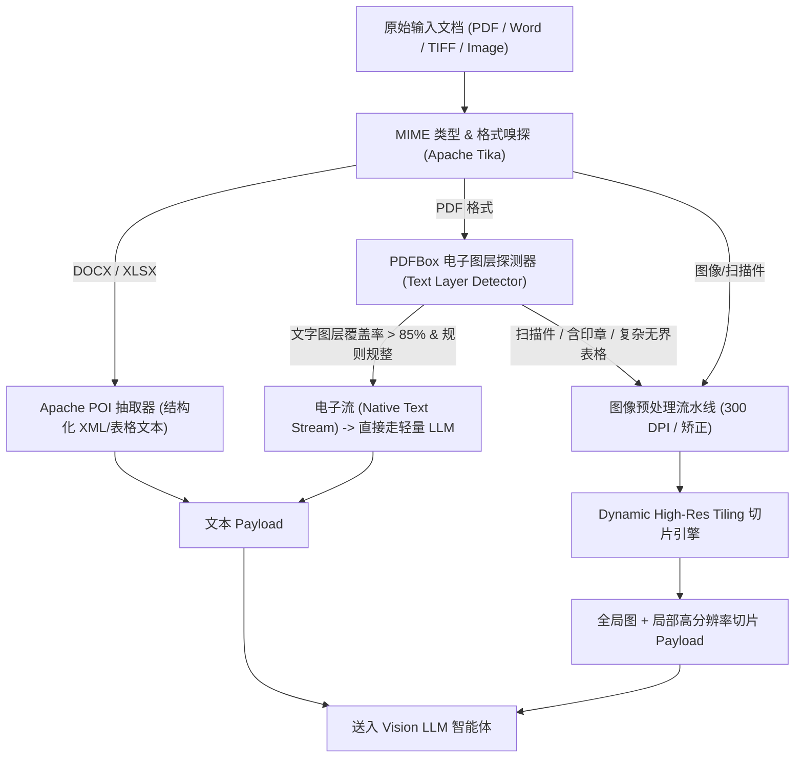
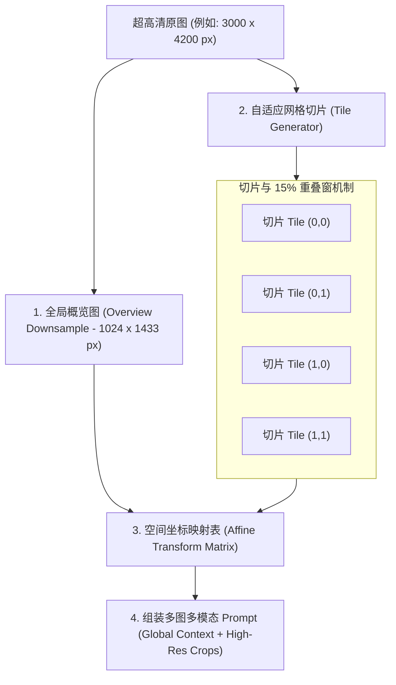

# 多源异构文档处理管线：从混合解析到视觉高动态切片（High-Res Tiling）

在企业级智能文档处理（IDP）场景中，系统面对的输入源极其繁复：可能是排版规整的电子 PDF、Word 文档，也可能是带有倾斜角度、盖章遮挡、微小字体或手写签批的高清扫描单据。

如何以**最低的 Token 消耗**、**最高的吞吐率**以及**极高保真度的版面细节**将异构文档送入大模型？这就要求我们设计一套兼具**智能分流（Hybrid Ingestion）**与**高动态切片（High-Res Tiling）**的文档处理管线。

本文将深入文档摄入层底层，系统拆解该流水线的核心算法与工程实现。

---

## 1. 混合分流路由（Hybrid Ingestion Pipeline）

盲目地将所有文档一律转为图片调用大模型视觉接口，不仅极度浪费 Token 成本，还会增加不必要的网络延迟。我们采用**双流自适应路由架构**：



### 1.1 PDF 原生文本图层嗅探器
利用 `Apache PDFBox` 快速扫描文档前 3 页的文本图层字符密度与字体嵌入情况，判断是否属于“纯电子 PDF”：

```java
package com.idp.engine.pipeline;

import org.apache.pdfbox.Loader;
import org.apache.pdfbox.pdmodel.PDDocument;
import org.apache.pdfbox.text.PDFTextStripper;
import org.springframework.stereotype.Component;

import java.io.File;
import java.io.IOException;

@Component
public class PdfLayerDetector {

    private static final int SAMPLE_PAGE_LIMIT = 3;
    private static final int CHAR_COUNT_THRESHOLD_PER_PAGE = 120;

    /**
     * 判断 PDF 是否包含高质量原生电子文字层
     */
    public boolean isNativeDigitalPdf(File pdfFile) {
        try (PDDocument document = Loader.loadPDF(pdfFile)) {
            int totalPages = Math.min(document.getNumberOfPages(), SAMPLE_PAGE_LIMIT);
            if (totalPages == 0) return false;

            PDFTextStripper stripper = new PDFTextStripper();
            int validTextPageCount = 0;

            for (int i = 1; i <= totalPages; i++) {
                stripper.setStartPage(i);
                stripper.setEndPage(i);
                String pageText = stripper.getText(document).trim();
                
                // 剔除乱码和无意义空白符后的实际字符数
                if (pageText.length() >= CHAR_COUNT_THRESHOLD_PER_PAGE) {
                    validTextPageCount++;
                }
            }

            // 若采样页均具备充足文字，且未检测到全局扫描位图覆盖，判定为电子 PDF
            return validTextPageCount == totalPages;
        } catch (IOException e) {
            // 解析异常时保守降级为视觉流处理
            return false;
        }
    }
}
```

---

## 2. 图像预处理：300 DPI 渲染与倾斜矫正

对于扫描件、带有印章或排版错综复杂的单据，必须将其转为高质量位图。

### 2.1 为什么必须是 300 DPI？
* **72/96 DPI（屏幕默认）**：小号英文字符（如 `8pt` 规格代码、发票税号）会发生严重抗锯齿模糊，大模型极易将 `8` 识别为 `3`，将 `0` 识别为 `O` 或 `D`。
* **300 DPI（印刷级标准）**：能够保留精细的笔画边缘与表格细线，同时文件体积适中，为后续切片提供高保真源数据。

### 2.2 基于 PDFBox 的高质量光栅化渲染
```java
package com.idp.engine.pipeline;

import org.apache.pdfbox.Loader;
import org.apache.pdfbox.pdmodel.PDDocument;
import org.apache.pdfbox.rendering.ImageType;
import org.apache.pdfbox.rendering.PDFRenderer;
import org.springframework.stereotype.Component;

import java.awt.image.BufferedImage;
import java.io.File;
import java.io.IOException;
import java.util.ArrayList;
import java.util.List;

@Component
public class PdfRasterizer {

    private static final float TARGET_DPI = 300f;

    /**
     * 将 PDF 各页光栅化为 300 DPI 高清 BufferedImage
     */
    public List<BufferedImage> renderToHighResImages(File pdfFile) throws IOException {
        List<BufferedImage> pageImages = new ArrayList<>();
        
        try (PDDocument document = Loader.loadPDF(pdfFile)) {
            PDFRenderer renderer = new PDFRenderer(document);
            int pageCount = document.getNumberOfPages();
            
            for (int pageIndex = 0; pageIndex < pageCount; pageIndex++) {
                // 渲染为 RGB 彩色图像，以保留印章（红色）与主体文字（黑色）的色彩反差
                BufferedImage image = renderer.renderImageWithDPI(pageIndex, TARGET_DPI, ImageType.RGB);
                pageImages.add(image);
            }
        }
        return pageImages;
    }
}
```

---

## 3. 核心算法：Dynamic High-Res Tiling（动态自适应切片）

### 3.1 视觉大模型（VLM）的分辨率瓶颈与 Patch 机制
主流视觉大模型（如 Claude 3.5、GPT-4o、Qwen2.5-VL）在接收输入图像时，内部均采用 **ViT（Vision Transformer）切块机制**：
* 图像通常会被等比例缩放（如限制最长边不超过 2048px），随后切分成 $14\times 14$ 或 $28\times 28$ 像素的 Patch。
* 对于一张宽幅长表格（如 $4000 \times 6000$ 像素的 A3 报关单），直接整体缩放会导致小文字被池化平均掉，丢失关键细节。

### 3.2 动态切片与重叠窗口算法设计



#### 算法核心要点：
1. **全局概览图（Global Overview）**：提供整张文档的宏观版面拓扑、页眉页脚与全局段落关系。
2. **局部切块（Local High-Res Tiles）**：将原图按照 $1024 \times 1024$ 窗口切片，保留 100% 原始像素细节。
3. **15% 重叠边缘（Overlap Margin）**：避免单行文字或表格横线刚好被切片边界横切截断而导致乱码。
4. **空间坐标逆变换（Inverse Coordinate Mapping）**：切片内识别出的 Bounding Box 通过仿射变换矩阵自动映射回原 PDF 坐标系。

### 3.3 Dynamic Tiler 切片算法核心实现

```java
package com.idp.engine.pipeline;

import java.awt.*;
import java.awt.image.BufferedImage;
import java.util.ArrayList;
import java.util.List;

public class DynamicHighResTiler {

    private final int tileWidth;
    private final int tileHeight;
    private final double overlapRatio;

    public DynamicHighResTiler(int tileWidth, int tileHeight, double overlapRatio) {
        this.tileWidth = tileWidth;
        this.tileHeight = tileHeight;
        this.overlapRatio = overlapRatio;
    }

    public record ImageTile(BufferedImage image, int startX, int startY, int width, int height, int tileIndex) {}

    /**
     * 对高分辨率单据执行动态切片与重叠窗生成
     */
    public List<ImageTile> generateTiles(BufferedImage sourceImage) {
        List<ImageTile> tiles = new ArrayList<>();
        int imgWidth = sourceImage.getWidth();
        int imgHeight = sourceImage.getHeight();

        // 计算步长（扣除重叠区域）
        int stepX = (int) (tileWidth * (1.0 - overlapRatio));
        int stepY = (int) (tileHeight * (1.0 - overlapRatio));

        int index = 0;
        for (int y = 0; y < imgHeight; y += stepY) {
            for (int x = 0; x < imgWidth; x += stepX) {
                // 边界保护：确保切片不超出原图边界
                int currentW = Math.min(tileWidth, imgWidth - x);
                int currentH = Math.min(tileHeight, imgHeight - y);

                BufferedImage subImage = sourceImage.getSubimage(x, y, currentW, currentH);
                tiles.add(new ImageTile(subImage, x, y, currentW, currentH, index++));

                if (x + currentW >= imgWidth) break;
            }
            if (y + currentH >= imgHeight) break;
        }

        return tiles;
    }
}
```

---

## 4. 空间坐标逆映射（Bounding Box Coordinate Remapping）

当视觉大模型在某个局部切片 `Tile(k)` 中识别出一个字段（如“合同编号”）并返回局部归一化坐标 `[ymin, xmin, ymax, xmax]` 时，系统需要精确将其还原至整页 PDF 的绝对点位（Points）中，以供前端高亮：

$$\begin{cases}
X_{global} = X_{tile\_start} + x_{local} \times W_{tile} \\
Y_{global} = Y_{tile\_start} + y_{local} \times H_{tile}
\end{cases}$$

$$\begin{cases}
X_{pdf} = \frac{X_{global}}{\text{DPI}} \times 72 \\
Y_{pdf} = \frac{Y_{global}}{\text{DPI}} \times 72
\end{cases}$$

通过上述数学变换，后端可以向前端返回标准统一的 PDF 点位坐标，抹平了切片细节，为前端 Canvas 标注奠定了数据基础。

---

## 5. 小结与下篇预告

通过构建本篇的**多源异构处理管线**，系统具备了：
1. **智能路由能力**：电子 PDF 毫秒级直通提取，降低 70% 视觉 Token 开销；
2. **超清解析能力**：借助 300 DPI 光栅化与 Dynamic High-Res Tiling 算法，彻底攻克微小字符、印章遮挡与宽幅报表的清晰度瓶颈。

在下一篇文章**《基于 AWS Bedrock (Claude 3.5) 的视觉 AI-OCR 智能体：结构化抽取与防幻觉设计》**中，我们将正式构建 AI Agent 的“大脑中枢”：深入拆解 Bedrock SDK 集成、JSON Schema 约束生成与防幻觉 Prompt 体系！
