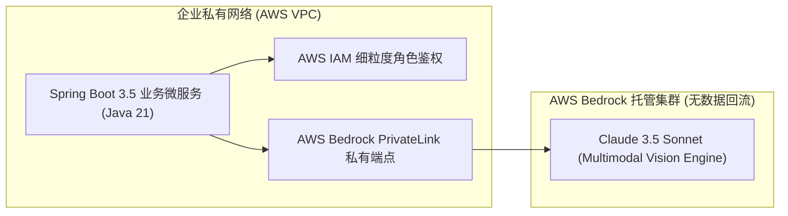
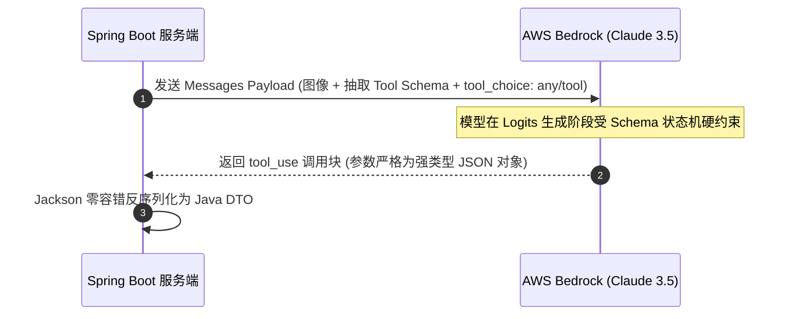
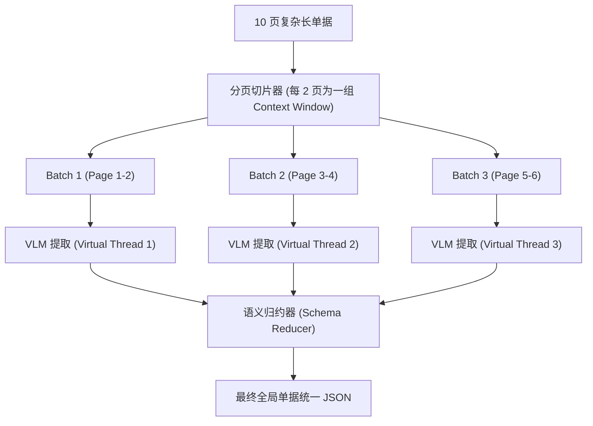

# 基于 AWS Bedrock (Claude 3.5) 的视觉 AI-OCR 智能体：结构化抽取与防幻觉设计

在将异构文档标准化为图像或文本切片后，核心任务便落在了**“智能体大脑”**上：如何让多模态大模型准确理解复杂的排版、嵌套表格、手写签名与印章，并**100% 稳定输出符合业务系统强类型契约的结构化 JSON**？

传统的做法往往依赖后置正则清洗，极易因大模型输出多余的 Markdown 标记、注释或格式漂移而导致系统反序列化崩溃。

本文将以 **AWS Bedrock + Claude 3.5 Sonnet** 为核心，系统阐述如何利用 **Tool Calling 约束生成**、**空间感知 Prompt 工程**与**多页合并机制**构建坚不可摧的视觉抽取中枢。

---

## 1. 为什么选择 AWS Bedrock 与 Claude 3.5 Sonnet？

在当今企业级多模态视觉处理领域，**Claude 3.5 Sonnet** 展现了极具统治力的多模态理解与逻辑推理能力：
1. **卓越的视觉空间感知**：能精准分辨紧贴的跨行表格、倾斜印章下覆盖的模糊字迹，以及手写批注；
2. **高保真复杂表格还原**：无需依赖额外的 OCR 后处理，原生理解合并单元格（Colspan / Rowspan）的归属逻辑；
3. **企业级合规与安全性（AWS Bedrock）**：数据不参与公开模型训练，具备 SOC2、ISO、HIPAA 认证，且提供 VPC 私有终端节点（PrivateLink）接入。



---

## 2. 结构化抽取硬约束：Tool Calling 机制

在生产环境中，如果仅在 Prompt 中指示 *"请输出 JSON 格式"*，模型仍可能偶发性输出 `Here is the JSON result: ```json ... ```'`，甚至在 JSON 外部附带解释性文字，这在自动化工业流水线中是绝对不可接受的。

### 2.1 解决方案：利用 Tool Use (Function Calling) 强制模式锁定
通过向 Bedrock 传递 `tool_choice` 参数，强制模型必须且只能调用指定的抽取工具 `extract_document_data`，由底层推理引擎保证输出**绝对符合 JSON Schema 规范**。



---

## 3. 空间感知 Prompt 工程与防幻觉设计

视觉文档抽取不同于纯文本问答，提示词设计必须强调**“视觉事实归因”**与**“空间几何对应”**。

### 3.1 核心 System Prompt 设计范式
```text
你是一个世界顶级的视觉文档分析与结构化抽取智能体专家。

【核心原则】
1. 绝对事实归因：你抽取的每一个字段必须严格来自传入图像中的可见事实。严禁基于常识进行主观猜测或脑补。
2. 模糊与缺失处理：若某字段在原图中不存在、被遮挡或彻底无法辨识，必须输出 null，严禁编造默认值。
3. 表格与印章识别：仔细区分表格表头与数据行。对于被红色印章覆盖的文字，透过印章色差比对笔画提取真实字符。
4. 数值精度：货币金额、重量、单价必须精确保留单据上展示的小数位数，不可自动四舍五入。
5. 坐标输出（Bounding Box）：在输出关键字段时，同时输出该字段在整页图像中的相对归一化矩形框 [ymin, xmin, ymax, xmax]，取值范围为 0 到 1000 的整数。
```

---

## 4. Java 21 + AWS Bedrock SDK v2 生产级集成实现

以下为基于 AWS SDK v2 的 `BedrockVisionExtractor` 核心服务实现，充分利用了 Java 21 的不可变 Record 与强类型 JSON 映射：

```java
package com.idp.engine.agent;

import com.fasterxml.jackson.databind.JsonNode;
import com.fasterxml.jackson.databind.ObjectMapper;
import org.slf4j.Logger;
import org.slf4j.LoggerFactory;
import org.springframework.stereotype.Service;
import software.amazon.awssdk.core.SdkBytes;
import software.amazon.awssdk.services.bedrockruntime.BedrockRuntimeClient;
import software.amazon.awssdk.services.bedrockruntime.model.InvokeModelRequest;
import software.amazon.awssdk.services.bedrockruntime.model.InvokeModelResponse;

import java.util.List;
import java.util.Map;

@Service
public class BedrockVisionExtractor {

    private static final Logger log = LoggerFactory.getLogger(BedrockVisionExtractor.class);
    private static final String MODEL_ID = "anthropic.claude-3-5-sonnet-20241022-v2:0";

    private final BedrockRuntimeClient bedrockClient;
    private final ObjectMapper objectMapper;

    public BedrockVisionExtractor(BedrockRuntimeClient bedrockClient, ObjectMapper objectMapper) {
        this.bedrockClient = bedrockClient;
        this.objectMapper = objectMapper;
    }

    /**
     * 传入图像与 JSON Schema，执行结构化抽取
     */
    public JsonNode extractStructuredData(byte[] imageBytes, String mimeType, Map<String, Object> jsonSchemaDefinition) {
        try {
            // 1. 定义 Tool 工具定义
            Map<String, Object> toolDefinition = Map.of(
                "name", "document_data_extractor",
                "description", "将文档图像内容提取为精确的强类型结构化数据",
                "input_schema", jsonSchemaDefinition
            );

            // 2. 组装 Claude 3.5 原生请求体 (使用 Tool Calling 模式)
            Map<String, Object> requestPayload = Map.of(
                "anthropic_version", "bedrock-2023-05-31",
                "max_tokens", 4096,
                "temperature", 0.0, // 0.0 保证最高确定性与防幻觉
                "tools", List.of(toolDefinition),
                "tool_choice", Map.of("type", "tool", "name", "document_data_extractor"),
                "messages", List.of(
                    Map.of(
                        "role", "user",
                        "content", List.of(
                            Map.of("type", "image", "source", Map.of(
                                "type", "base64",
                                "media_type", mimeType,
                                "data", SdkBytes.fromByteArray(imageBytes).asBase64()
                            )),
                            Map.of("type", "text", "text", "请仔细审阅该单据图像，提取所有关键信息并调用工具输出。")
                        )
                    )
                )
            );

            String requestJson = objectMapper.writeValueAsString(requestPayload);

            InvokeModelRequest invokeRequest = InvokeModelRequest.builder()
                .modelId(MODEL_ID)
                .contentType("application/json")
                .accept("application/json")
                .body(SdkBytes.fromUtf8String(requestJson))
                .build();

            // 3. 发起调用并解析 Tool Use 参数
            InvokeModelResponse response = bedrockClient.invokeModel(invokeRequest);
            JsonNode responseJson = objectMapper.readTree(response.body().asUtf8String());

            // 提取 tool_use 结果块
            JsonNode toolUseNode = findToolUseBlock(responseJson);
            if (toolUseNode == null || !toolUseNode.has("input")) {
                throw new IllegalStateException("大模型未按预期返回结构化 Tool 结果");
            }

            JsonNode extractedResult = toolUseNode.get("input");
            log.info("Bedrock 结构化提取成功完成");
            return extractedResult;

        } catch (Exception e) {
            log.error("调用 AWS Bedrock 抽取发生异常: {}", e.getMessage(), e);
            throw new DocumentExtractionException("智能体文档提取失败", e);
        }
    }

    private JsonNode findToolUseBlock(JsonNode responseJson) {
        JsonNode contentArray = responseJson.get("content");
        if (contentArray != null && contentArray.isArray()) {
            for (JsonNode block : contentArray) {
                if ("tool_use".equals(block.path("type").asText())) {
                    return block;
                }
            }
        }
        return null;
    }
}
```

---

## 5. 多页超长文档的 Token 经济学与分块合并

对于长达数十页的合同、货运清单或年报：
* **单次全量输入问题**：单次传入数十张高清图极易超出单次请求的上下文窗口限制或单次请求 Payload 限制（Bedrock 单次请求通常限制为 25MB），且推理成本陡增。
* **分块与归约（Map-Reduce）**：
  1. **Page-level Extraction（Map 阶段）**：利用第一篇讲到的 Java 21 虚拟线程，并发向 Bedrock 提交各页（或相邻 2 页）的提取请求；
  2. **Schema-aware Merging（Reduce 阶段）**：将各页的 `items` 数组追加合并，汇总全局 `total_summary`，并通过逻辑消重算法抹平跨页表格重复的表头行。



---

## 6. 小结与下篇预告

通过引入 **AWS Bedrock + Claude 3.5 Sonnet** 并施加 **Tool Calling Schema 硬约束**，我们从根源上消除了大模型的格式幻觉与反序列化异常。

然而，大模型给出的数据在“业务语义上”是否绝对自洽？是否存在明细金额累加不等于总金额？若校验失败，大模型能否像人类一样“重新看图纠正”？

在下一篇文章**《Agentic 校验闭环：可信规则引擎、自我反思纠错（Self-Correction）与置信度量化》**中，我们将揭秘智能体最核心的**自我反思自愈（Self-Correction Loop）机制**！
