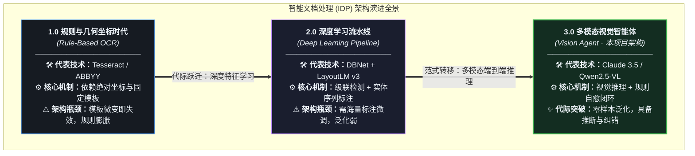
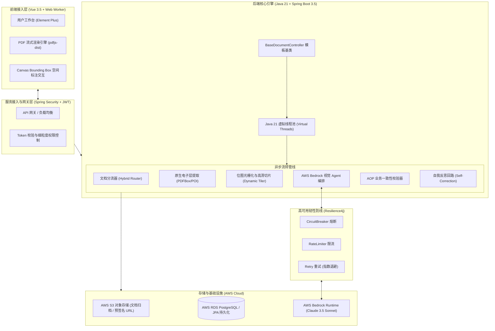
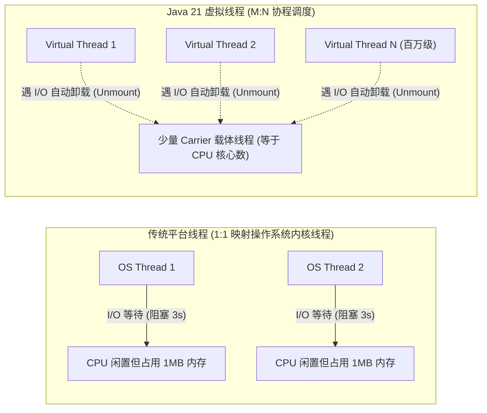
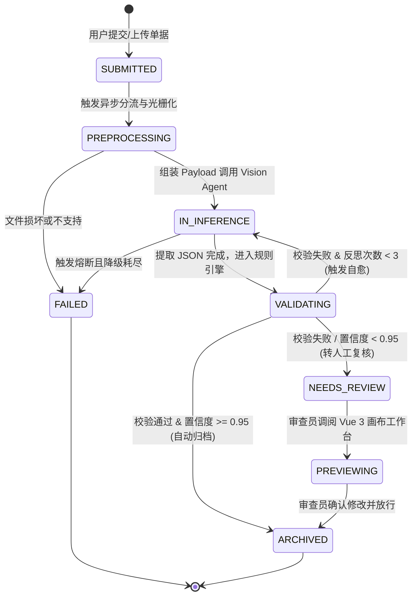

# 企业级 AI-OCR #1：企业级智能文档处理架构演进与 Java 21 异步底座

在现代企业级信息化与数字化转型中，**非结构化/半结构化文档（PDF、扫描单据、合同、发票、检验报告）的自动化提取与归档**一直是核心瓶颈。据统计，企业超过 80% 的关键数据沉淀在非结构化文档中。

传统的 OCR 与正则流水线面对多变版式、印章干扰、手写批注和跨页表格时往往力不从心。随着 **大语言模型（LLM）与多模态视觉大模型（Vision LLMs）** 的成熟，智能文档处理（Intelligent Document Processing, IDP）迎来了架构级范式转移。

本文作为本专栏的开篇，将从系统架构师的视角，系统解构 IDP 系统的代际演进，并详细拆解如何利用 **Java 21（LTS）+ Spring Boot 3.5** 构建高并发、高吞吐的异步处理底座。

---

## 1. 智能文档处理（IDP）的技术代际演进

理解技术演进的本质，有助于我们在技术选型时不盲目跟风，准确把握不同方案的工程边界。



### 1.1 三代技术方案的核心特征与局限对比

| 评估维度 | 第一代：传统 OCR + 规则坐标 | 第二代：深度学习 + 版面分析 | 第三代：多模态 Agent（本项目架构） |
| :--- | :--- | :--- | :--- |
| **版面适应性** | 极度脆弱（仅支持固定像素模板） | 较好（支持已训练版面类型） | **极高（无需模板，基于空间语义推断）** |
| **复杂表格处理** | 行列错位、跨页断行频发 | 依赖复杂的后处理启发式算法 | **极强（原生识别合并单元格与层级逻辑）** |
| **逻辑推断能力** | 无（无法判断数值平衡与时间因果） | 无（仅输出文本及预测实体类别） | **具备（可进行算术核对、跨字段语义推导）** |
| **异常自愈机制** | 无 | 无 | **具备（校验报错触发反思纠错回路）** |
| **工程开发成本** | 每增加一种版式需定制规则，不可控 | 需专职算法团队标注、训练与调优 | **Schema 驱动，Prompt 工程化，敏捷迭代** |

---

## 2. 现代企业级 IDP 全栈架构全景图

针对大文件、高并发、长耗时与多格式混杂的特征，现代 IDP 平台应采用 **“解耦输入、多模态智能中枢、硬规则守门、人机协同保底”** 的分层架构：



---

## 3. Java 21 虚拟线程（Virtual Threads）构建异步高吞吐底座

### 3.1 为什么传统线程池在 IDP 场景下会成为瓶颈？
在智能文档处理场景中，单个请求的处理耗时通常在 **1.5s ~ 8s** 之间（包含 PDF 转图像、S3 读写、Bedrock 外部 API 交互、规则引擎运算）。

* **传统平台线程模型（1:1 内核线程）**：
  操作系统内核线程开销大（单个栈占用约 1MB 内存）。在面对数百个并发文档上传时，若分配 200 个平台线程，大部分线程都处于 `BLOCKED` 或 `TIMED_WAITING` 状态等待外部 I/O 返回，造成巨大的内存浪费与上下文切换开销，极易发生线程池耗尽（Thread Starvation）。



### 3.2 Spring Boot 3.5 开启虚拟线程
在 Spring Boot 3.2+ / 3.5 中，只需在 `application.yml` 中开启原生虚拟线程支持，所有 Tomcat 接收的 HTTP 请求及 `@Async` 异步任务将全量由虚拟线程驱动：

```yaml
spring:
  threads:
    virtual:
      enabled: true
  task:
    execution:
      pool:
        # 虚拟线程无需配置固定池大小，按需创建与销毁
        core-size: 0
```

### 3.3 结构化并发（Structured Concurrency）实战
当处理一份包含 10 页的复杂多页单据时，我们需要并发切片、分批提取并进行最终汇总。利用 Java 21 的 `StructuredTaskScope`，我们可以实现 **“任务生命周期同生共死”**，防止产生孤儿任务和隐蔽的资源泄漏：

```java
package com.idp.engine.concurrency;

import jdk.incubator.concurrent.StructuredTaskScope;
import org.slf4j.Logger;
import org.slf4j.LoggerFactory;
import org.springframework.stereotype.Component;

import java.util.List;
import java.util.concurrent.Future;

@Component
public class ParallelPageProcessingManager {

    private static final Logger log = LoggerFactory.getLogger(ParallelPageProcessingManager.class);

    /**
     * 结构化并发处理文档多页提取任务
     */
    public List<PageExtractionResult> processPagesInParallel(List<PageTask> pageTasks) {
        log.info("开始并发处理 {} 个子页面，由 Java 21 虚拟线程调度...", pageTasks.size());

        // 使用 ShutdownOnFailure 策略：任一关键子页提取失败即快速失败并取消其他子任务
        try (var scope = new StructuredTaskScope.ShutdownOnFailure()) {
            List<StructuredTaskScope.Subtask<PageExtractionResult>> subtasks = pageTasks.stream()
                .map(task -> scope.fork(task::executeExtraction))
                .toList();

            // 等待所有子任务完成或发生首个异常
            scope.join();
            scope.throwIfFailed(RuntimeException::new);

            // 汇总提取结果
            return subtasks.stream()
                .map(StructuredTaskScope.Subtask::get)
                .toList();
        } catch (Exception e) {
            log.error("多页并发抽取失败，结构化作用域已自动取消关联子任务: {}", e.getMessage());
            throw new DocumentProcessingException("并发处理多页单据失败", e);
        }
    }
}
```

---

## 4. 架构抽象：BaseDocumentController 与生命周期状态机

企业级业务通常涵盖多种单据类型（如采购订单、报关提单、质检证明、结算发票）。为了保证架构的整洁与高度复用，避免在各业务 Controller 中反复手写文档校验、存储与异步转交流程，采用 **模板方法模式（Template Method Pattern）** 抽象出 `BaseDocumentController`。

### 4.1 文档全生命周期状态机（State Machine）



### 4.2 统一控制器抽象实现

```java
package com.idp.controller.base;

import com.idp.dto.DocumentProcessResponse;
import com.idp.dto.DocumentUploadRequest;
import com.idp.enums.DocumentStatus;
import com.idp.service.base.DocumentProcessingService;
import jakarta.validation.Valid;
import org.slf4j.Logger;
import org.slf4j.LoggerFactory;
import org.springframework.http.ResponseEntity;
import org.springframework.web.bind.annotation.*;
import org.springframework.web.multipart.MultipartFile;

/**
 * 跨业务模块统一文档处理泛型抽象基类
 *
 * @param <TReq>  业务上传请求 DTO
 * @param <TData> 业务结构化数据实体类型
 */
public abstract class BaseDocumentController<TReq extends DocumentUploadRequest, TData> {

    protected final Logger log = LoggerFactory.getLogger(getClass());
    protected final DocumentProcessingService<TData> documentProcessingService;

    protected BaseDocumentController(DocumentProcessingService<TData> documentProcessingService) {
        this.documentProcessingService = documentProcessingService;
    }

    /**
     * 统一文档上传与异步接入入口
     */
    @PostMapping(value = "/upload", consumes = "multipart/form-data")
    public ResponseEntity<DocumentProcessResponse> handleUpload(
            @RequestPart("file") MultipartFile file,
            @Valid @RequestPart("metadata") TReq metadata) {

        log.info("收到文档上传请求: file={}, type={}", file.getOriginalFilename(), getDocumentCategory());

        // 1. 前置标准校验（文件大小、MIME 类型安全检查）
        validateFile(file);

        // 2. 钩子方法：子类可覆盖执行特定业务校验
        preProcessValidation(file, metadata);

        // 3. 进入异步处理流转，返回单据追踪 Tracking ID
        String documentTrackingId = documentProcessingService.submitForProcessing(
            file, 
            metadata, 
            getDocumentCategory()
        );

        return ResponseEntity.accepted().body(
            new DocumentProcessResponse(documentTrackingId, DocumentStatus.SUBMITTED, "文档已受理，正在异步解析中")
        );
    }

    /**
     * 统一文档状态与提取结果查询入口
     */
    @GetMapping("/{trackingId}/status")
    public ResponseEntity<DocumentStatusResult<TData>> getProcessingStatus(@PathVariable String trackingId) {
        DocumentStatusResult<TData> statusResult = documentProcessingService.getStatus(trackingId);
        return ResponseEntity.ok(statusResult);
    }

    /**
     * 子类声明具体的单据类别
     */
    protected abstract String getDocumentCategory();

    /**
     * 可选扩展钩子方法
     */
    protected void preProcessValidation(MultipartFile file, TReq metadata) {
        // 默认空实现，允许子类重写扩展
    }

    private void validateFile(MultipartFile file) {
        if (file.isEmpty()) {
            throw new IllegalArgumentException("上传文件不能为空");
        }
        if (file.getSize() > 50 * 1024 * 1024) { // 50MB 限制
            throw new IllegalArgumentException("文档体积超出上限 (50MB)");
        }
    }
}
```

---

## 5. 小结与下篇预告

在本篇中，我们完成了两项核心基础建设：
1. **认知对齐**：明确了多模态 Vision Agent 相比前两代 OCR 技术在复杂版式、表格理解与逻辑自愈上的颠覆性优势；
2. **底座就绪**：基于 **Java 21 虚拟线程**与 `BaseDocumentController` 抽象，构建了高并发、高弹性且规范统一的异步文档处理框架。

在下一篇文章 **《定型与非定型文档分类路由：架构分野与工作流分发策略》** 中，我们将深入真实企业级文档输入层，剖析面对多样化异构单据时，如何通过特征指纹快速区分定型（模板化）与非定型（通用非结构化）文档，并利用策略模式与注册表机制实现毫秒级精准路由分流！
