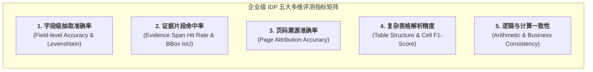
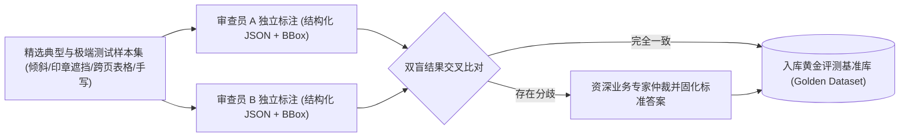
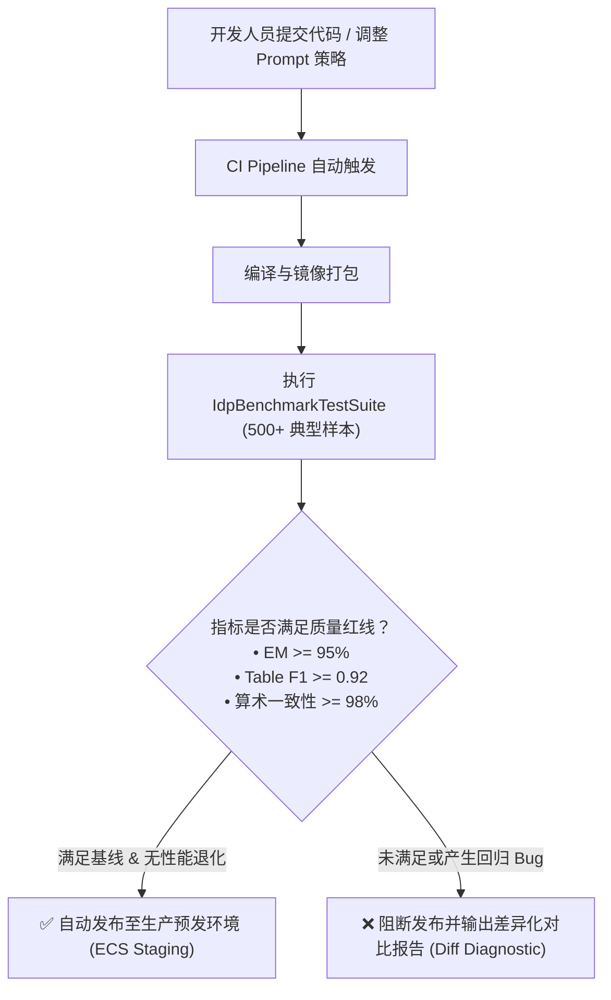
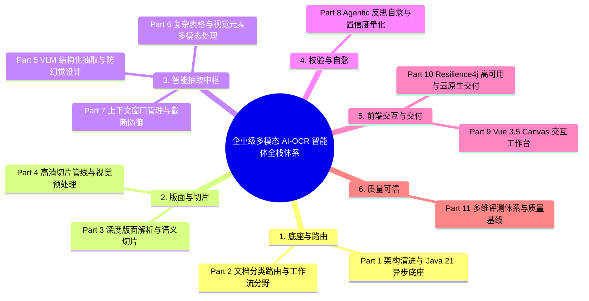

# 多维评测体系与质量基线：从标准集构建到 CI/CD 自动化 Benchmark

在企业级 AI 系统中，**“无法量化，就无法优化”**。

在实验室或 Demo 阶段，针对几份样本调通 Prompt 并不困难；但在真实生产环境中，当面对成千上万份涵盖不同清晰度、不同印章遮挡、不同排版结构的文档时，任何一次模型微调或 Prompt 迭代都可能在解决某类问题的同时，悄然引发其他单据的“回归劣化”。

系统最后的测试指标是什么？标准评测答案生成是否正确？证据片段是否精准命中？页码追溯是否分毫不差？表格结构与计算校验是否严丝合缝？

作为本专栏的收官之作，本文将系统解构工业级 IDP 系统的**多维评测体系设计、自动化 Benchmark 流水线**以及全专栏技术架构总复盘。

---

## 1. 为什么工业级 IDP 必须构建多维评测体系？

传统的 OCR 评测通常只看 **字错率（CER / WER）**，但这在结构化提取场景中存在致命缺陷：即使整篇文字识别率达到 99%，但若关键的“总金额”少了一个 0 或将“USD”识别为“EUR”，对业务系统而言该次提取的有效性就是 0。

因此，现代 IDP 评测必须从“字符级”跃迁至 **“业务语义、几何证据与逻辑自洽”** 的多维立体评估：



---

## 2. Ground Truth 基准数据集（Golden Dataset）构建规范

高质量的评测离不开坚实的黄金基准集（Ground Truth）。基准数据集的构建流程遵循严格的**双盲标注与机器辅助校验**：



---

## 3. 五大核心评测指标定义与数学建模

### 3.1 字段级准确率（Field-Level Accuracy）
对于枚举、日期、编号等定型字段采用**精确匹配（Exact Match, EM）**；对于自由文本描述采用**归一化编辑距离相似度（Normalized Levenshtein Similarity）**：

$$\text{Sim}_{Lev}(S_{pred}, S_{gt}) = 1 - \frac{\text{LevenshteinDistance}(S_{pred}, S_{gt})}{\max(|S_{pred}|, |S_{gt}|)}$$

### 3.2 证据片段与空间坐标命中率（Evidence Span & BBox IoU）
不仅提取出的值要对，模型所声称的坐标位置（Bounding Box）必须与原文真实位置交并比（Intersection over Union, IoU）$\ge 0.5$：

$$\text{IoU}(B_{pred}, B_{gt}) = \frac{\text{Area}(B_{pred} \cap B_{gt})}{\text{Area}(B_{pred} \cup B_{gt})}$$

### 3.3 页码溯源准确率（Page Attribution Accuracy）
针对多页单据，验证模型提取字段所标注的来源页码（`pageNumber`）是否与黄金集中真实所在页面 100% 一致，防止跨页张冠李戴。

### 3.4 复杂表格解析 F1 分数（Table Cell F1-Score）
从单元格坐标、内容、行列索引、币种/单位属性四个维度综合计算 Precision、Recall 与 F1：

$$\text{F1}_{table} = 2 \times \frac{\text{Precision}_{cell} \times \text{Recall}_{cell}}{\text{Precision}_{cell} + \text{Recall}_{cell}}$$

### 3.5 算术与格式一致性（Arithmetic Consistency）
验证提取出的明细项累加和、税率计算公式是否完全自洽：$\sum \text{lineAmount} == \text{totalAmount}$。

---

## 4. 基于 Java 21 + JUnit 5 的自动化 Benchmark Pipeline

将评测流水线深度集成于代码工程中，实现一键运行多维 Benchmark 并输出结构化指标报告：

```java
package com.idp.engine.benchmark;

import com.fasterxml.jackson.databind.JsonNode;
import com.fasterxml.jackson.databind.ObjectMapper;
import org.junit.jupiter.api.DisplayName;
import org.junit.jupiter.api.Test;
import org.slf4j.Logger;
import org.slf4j.LoggerFactory;
import org.springframework.beans.factory.annotation.Autowired;
import org.springframework.boot.test.context.SpringBootTest;

import java.io.File;
import java.util.List;

import static org.junit.jupiter.api.Assertions.assertTrue;

@SpringBootTest
public class IdpBenchmarkTestSuite {

    private static final Logger log = LoggerFactory.getLogger(IdpBenchmarkTestSuite.class);

    @Autowired
    private BenchmarkRunner benchmarkRunner;

    @Autowired
    private ObjectMapper objectMapper;

    @Test
    @DisplayName("运行全量黄金基准集自动化多维质量回归评测")
    void executeFullRegressionBenchmark() throws Exception {
        File benchmarkDatasetDir = new File("src/test/resources/golden-dataset");
        
        BenchmarkReport report = benchmarkRunner.evaluateDirectory(benchmarkDatasetDir);

        log.info("========== IDP 自动化评测结果基线报告 ==========");
        log.info("评测文档总数: {}", report.totalDocuments());
        log.info("字段抽取精确匹配率 (EM): {}%", String.format("%.2f", report.exactMatchRate() * 100));
        log.info("证据片段 BBox 命中率 (IoU >= 0.5): {}%", String.format("%.2f", report.bboxHitRate() * 100));
        log.info("页码追溯准确率: {}%", String.format("%.2f", report.pageAttributionAccuracy() * 100));
        log.info("复杂表格解析 F1-Score: {}", String.format("%.4f", report.tableF1Score()));
        log.info("算术逻辑自洽率: {}%", String.format("%.2f", report.arithmeticConsistencyRate() * 100));
        log.info("===============================================");

        // 设定 CI/CD 发布质量红线门禁
        assertTrue(report.exactMatchRate() >= 0.95, "字段抽取准确率未达发布门禁 (95%)");
        assertTrue(report.tableF1Score() >= 0.92, "表格解析 F1 未达发布门禁 (0.92)");
        assertTrue(report.arithmeticConsistencyRate() >= 0.98, "算术自洽率未达发布门禁 (98%)");
    }
}
```

---

## 5. 持续集成中的质量门禁（CI/CD Quality Gate）

通过在 GitLab CI / GitHub Actions 流水线中嵌入自动化 Benchmark，任何 Prompt 调整、依赖升级或切片算法重构都必须经过基准测试的检验：



---

## 6. 全专栏 11 篇全景复盘与架构大地图

通过本专栏共 11 篇体系化、深度的技术长文，我们从零到一完整走过了现代企业级 AI-OCR 智能体的全栈工程落地旅程：



这一整套架构不仅成功攻克了非定型/定型文档混合处理、多栏防混、跨页表格连续性、超长文档防截断与表格内图片多模态理解等一系列工业级“硬骨头”挑战，更将 **Java 21 现代高性能底座、Vue 3.5 现代化交互前端、Resilience4j 防御性容错与 AWS Bedrock 多模态生成式 AI** 完美融合。

希望本专栏能够为你构建工业级、高可用、可信赖的智能文档处理（IDP）系统提供最坚实的技术参考与架构指引！
