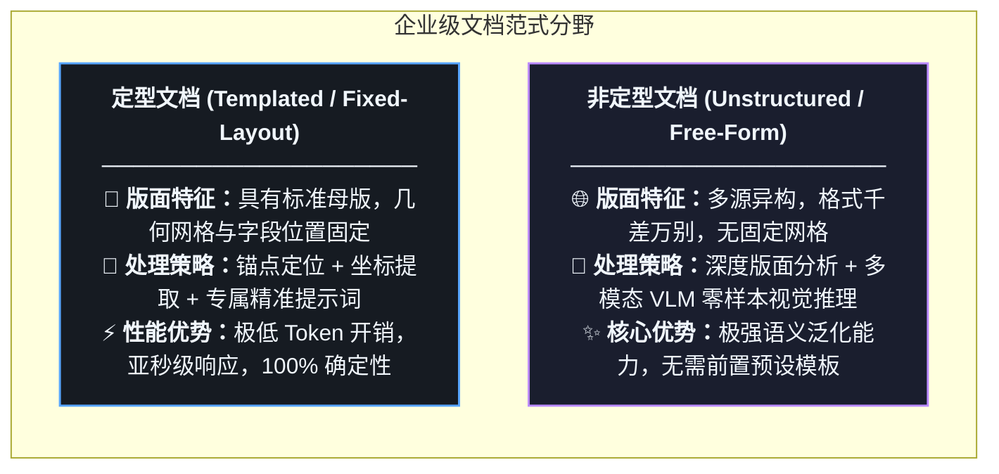
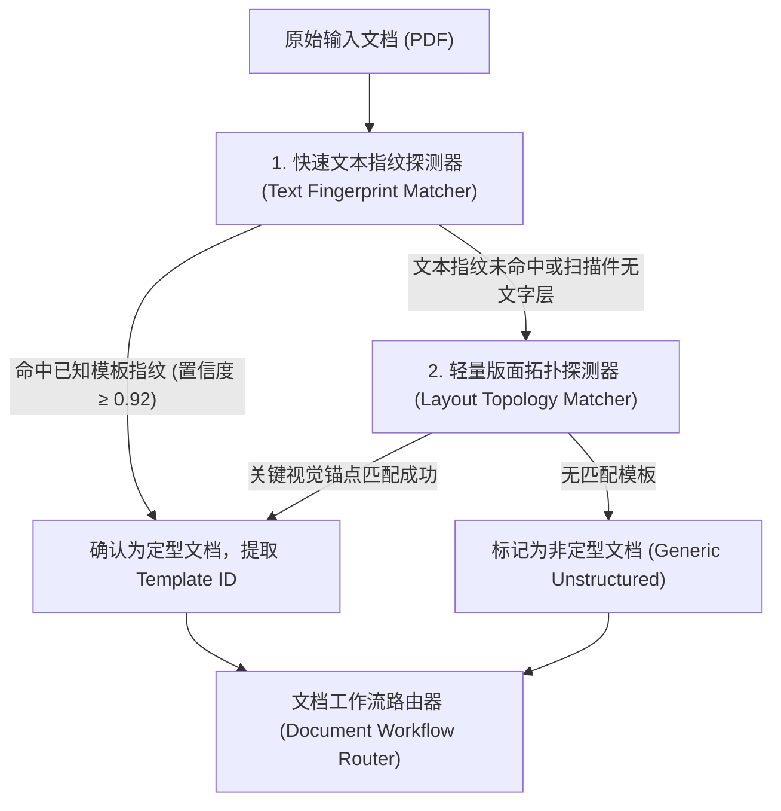
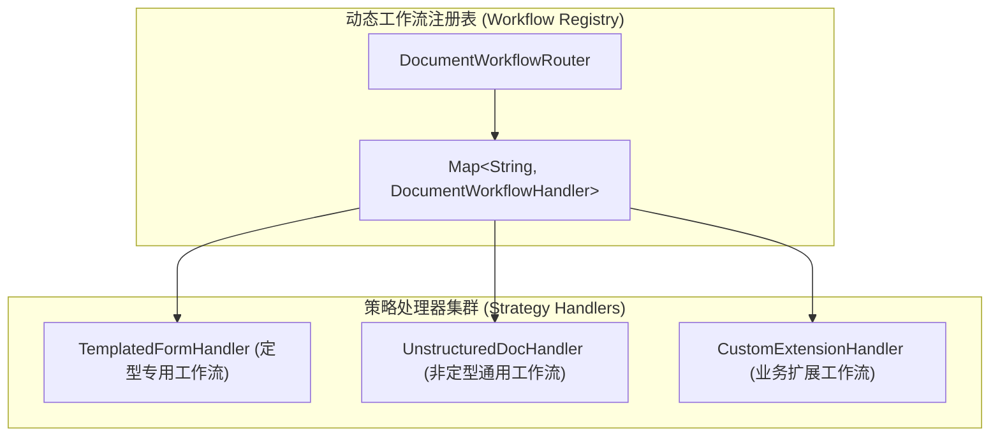
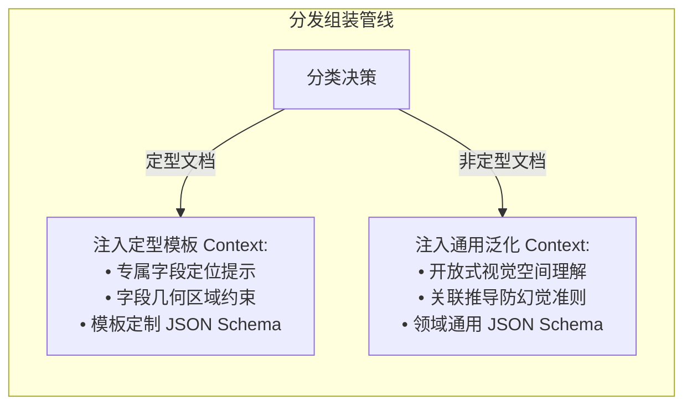

# 定型与非定型文档分类路由：架构分野与工作流分发策略

在真实企业级文档智能化处理场景中，系统面对的文件绝非千篇一律。从版面严格固定的格式化申请表，到来自不同国家、机构且格式各异的说明函与商业书面文件，文档在结构化程度上存在巨大差异。

如果对所有文档都采用完全相同的“通用端到端大模型泛化推理”流水线，不仅会导致高昂且不必要的 Token 算力开销与响应延迟，在面对具备严格坐标规范的定型表单时，还会由于大模型的微小随机性而丧失确定性精度。

因此，**在文档进入视觉提取中枢之前，实施高精度的分类与工作流路由分发**，是构建高性能、低成本工业级 IDP 系统的关键第一步。

---

## 1. 企业级文档的两大范式：定型 vs 非定型

从技术实现与数据结构的角度，企业级 PDF 文档可抽象归纳为两大阵营：



### 1.1 定型与非定型处理策略对比

| 评估维度 | 定型文档（Templated） | 非定型文档（Unstructured） |
| :--- | :--- | :--- |
| **版面特征** | 字段标签与输入框具有固定的相对几何拓扑 | 排版自由多变，可能包含多栏、多段落与自由表格 |
| **前置资产依赖** | 依赖预注册的模板元数据（Anchor Point / BBox） | 仅依赖输出契约（JSON Schema）与领域知识库 |
| **提示词工程** | **专型专属 Prompt**（注入明确的字段约束与几何线索） | **通用泛化 Prompt**（指导模型进行上下文语义关联推导） |
| **Token 开销** | 极低（可按区域裁剪局部图像输入） | 适中至较高（需输入完整页面与上下文） |
| **核心挑战** | 扫描倾斜、缩放偏移、版本微调兼容 | 跨页截断、多栏混排、表格表头歧义 |

---

## 2. 文档分类探测引擎（Document Classification Engine）

为了在毫秒级内准确识别输入文档属于哪种定型模板或判定为通用非定型文档，系统设计了轻量级**两阶段特征嗅探器**：



### 2.1 结构指纹探测器实现

利用文档前两页的核心关键词哈希指纹（如特定的标准编号、机构固定印记、固定表头关键词集合）进行 $O(1)$ 快速哈希与 Jaccard 相似度匹配：

```java
package com.idp.engine.classifier;

import org.springframework.stereotype.Component;

import java.util.*;

/**
 * 轻量级文档结构指纹分类探测器
 */
@Component
public class DocumentFingerprintClassifier {

    private static final double SIMILARITY_THRESHOLD = 0.85;

    // 预注册的定型模板特征指纹库 (特征关键词集合)
    private final Map<String, Set<String>> templateFingerprintRegistry = new HashMap<>();

    public record ClassificationResult(String templateId, boolean isTemplated, double confidence) {}

    public DocumentFingerprintClassifier() {
        // 注册定型文档指纹特征集 (示例通用模式)
        templateFingerprintRegistry.put("TEMPLATE_FORM_TYPE_A", Set.of("STANDARD-REF-NO", "ISSUING-AUTHORITY", "DECLARATION-SECTION"));
        templateFingerprintRegistry.put("TEMPLATE_FORM_TYPE_B", Set.of("REGISTRATION-CODE", "CERTIFICATE-OF-ORIGIN", "VALIDITY-PERIOD"));
    }

    /**
     * 基于页面提取的文本词袋计算特征相似度
     */
    public ClassificationResult classify(List<String> pageTokens) {
        if (pageTokens == null || pageTokens.isEmpty()) {
            return new ClassificationResult(null, false, 0.0);
        }

        Set<String> tokenSet = new HashSet<>(pageTokens);
        String bestMatchTemplate = null;
        double maxSimilarity = 0.0;

        for (Map.Entry<String, Set<String>> entry : templateFingerprintRegistry.entrySet()) {
            double similarity = computeJaccardSimilarity(tokenSet, entry.getValue());
            if (similarity > maxSimilarity) {
                maxSimilarity = similarity;
                bestMatchTemplate = entry.getKey();
            }
        }

        if (maxSimilarity >= SIMILARITY_THRESHOLD && bestMatchTemplate != null) {
            return new ClassificationResult(bestMatchTemplate, true, maxSimilarity);
        }

        // 未达到阈值，归入非定型文档处理流
        return new ClassificationResult("GENERIC_UNSTRUCTURED", false, 1.0 - maxSimilarity);
    }

    private double computeJaccardSimilarity(Set<String> setA, Set<String> setB) {
        Set<String> intersection = new HashSet<>(setA);
        intersection.retainAll(setB);
        if (intersection.isEmpty()) return 0.0;

        Set<String> union = new HashSet<>(setA);
        union.addAll(setB);
        return (double) intersection.size() / union.size();
    }
}
```

---

## 3. 基于策略模式的动态工作流路由器

在 Spring Boot 3.5 容器启动时，系统通过依赖注入自动收集所有实现了 `DocumentWorkflowHandler` 接口的处理策略，并维护在并发安全的路由注册表中。



### 3.1 路由器与策略接口核心实现

```java
package com.idp.engine.router;

import com.fasterxml.jackson.databind.JsonNode;
import com.idp.engine.classifier.DocumentFingerprintClassifier.ClassificationResult;
import org.slf4j.Logger;
import org.slf4j.LoggerFactory;
import org.springframework.stereotype.Service;

import java.io.File;
import java.util.List;
import java.util.Map;
import java.util.concurrent.ConcurrentHashMap;

/**
 * 文档工作流分发路由核心服务
 */
@Service
public class DocumentWorkflowRouter {

    private static final Logger log = LoggerFactory.getLogger(DocumentWorkflowRouter.class);
    private final Map<String, DocumentWorkflowHandler> handlerRegistry = new ConcurrentHashMap<>();

    public DocumentWorkflowRouter(List<DocumentWorkflowHandler> handlers) {
        // 自动注入并注册所有处理策略
        for (DocumentWorkflowHandler handler : handlers) {
            handlerRegistry.put(handler.getSupportedCategory(), handler);
            log.info("注册文档工作流处理器: category={}, handler={}", 
                     handler.getSupportedCategory(), handler.getClass().getSimpleName());
        }
    }

    /**
     * 根据分类探测结果路由到对应工作流
     */
    public JsonNode routeAndExecute(File documentFile, ClassificationResult classification) {
        String targetCategory = classification.isTemplated() 
                ? classification.templateId() 
                : "GENERIC_UNSTRUCTURED";

        DocumentWorkflowHandler handler = handlerRegistry.get(targetCategory);
        if (handler == null) {
            // 降级使用通用非定型处理器
            log.warn("未找到特定处理器: category={}, 降级使用通用非定型工作流", targetCategory);
            handler = handlerRegistry.get("GENERIC_UNSTRUCTURED");
        }

        log.info("执行文档工作流: handler={}, isTemplated={}", handler.getClass().getSimpleName(), classification.isTemplated());
        return handler.process(documentFile, classification);
    }
}
```

---

## 4. 定型 vs 非定型提示词与 Schema 动态分发机制

不同类型文档进入流水线后，系统会动态组装出完全不同的**提示词（Prompt）与 JSON Schema 契约**：



### 4.1 提示词分发工厂（Prompt Dispatcher Factory）

```java
package com.idp.engine.agent;

import org.springframework.stereotype.Component;
import java.util.Map;

@Component
public class WorkflowContextFactory {

    /**
     * 根据文档分类结果获取定制化 System Prompt
     */
    public String buildSystemPrompt(String templateId, boolean isTemplated) {
        if (isTemplated) {
            return """
                你是一个专门处理定型格式化单据的视觉解析专家。
                【定型处理准则】
                1. 该单据版面结构严格遵循既定模板，请优先根据字段标签与对应输入网格的几何相对位置进行精准提取。
                2. 对于预定义表格区域，严格按行列对其，忽略页面背景微弱底纹干扰。
                3. 输出格式严格对齐专用 Schema，不得增删顶层字段。
                """;
        }

        return """
            你是一个处理复杂非定型书面文档的通用视觉智能体。
            【非定型处理准则】
            1. 文档版面格式自由多变，可能包含多栏排版、跨页段落及嵌入式报表，请首先通过全局空间拓扑理解行文逻辑。
            2. 严禁基于推测编造事实，对于未在文档中明确展现的信息一律置为 null。
            3. 对于自由分布的键值对，依据就近原则与语义依赖链条进行绑定抽取。
            """;
    }
}
```

---

## 5. 小结与下篇预告

通过引入 **轻量级分类探测引擎** 与 **策略路由器**，我们实现了：
1. **精准分流**：定型文档走模板化快速通道，获得 100% 确定的几何约束与低算力开销；
2. **弹性泛化**：非定型文档走多模态深度视觉推理流，具备极强的零样本适应性；
3. **架构解耦**：新增任何新型文档格式只需扩展独立 Handler，无需修改核心编排底座。

在下一篇文章 **《深度版面解析与语义切片：多栏防混、页眉清洗与跨页表格连续性》** 中，我们将深入非结构化复杂文档的内部，系统攻克多栏混排、页眉页脚噪声以及跨页表格断点合并等经典版面难题！
