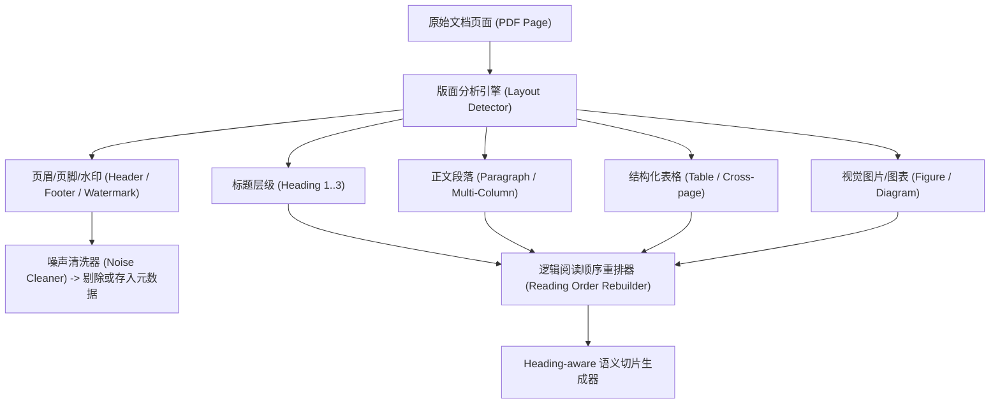
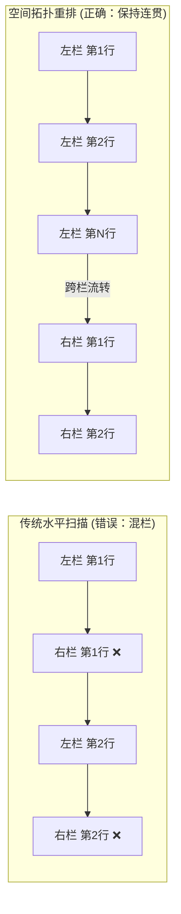
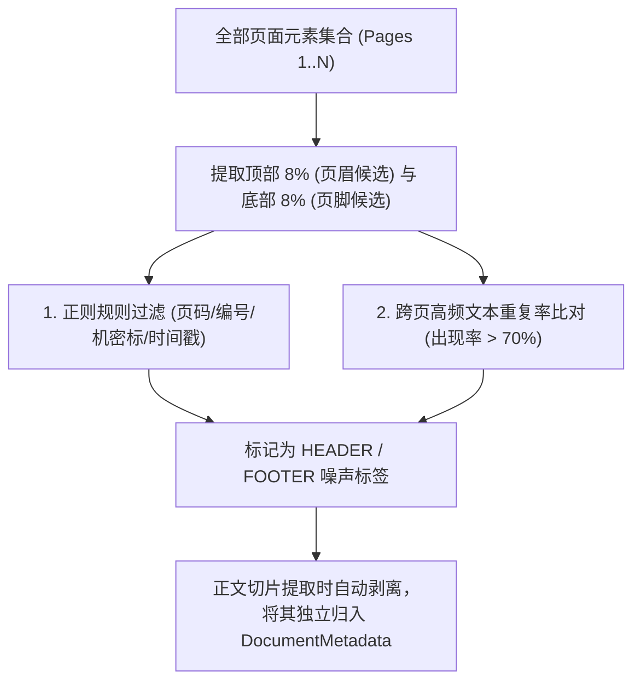
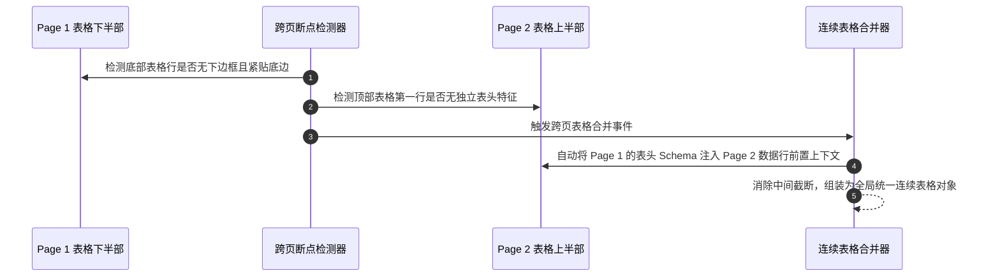

# 深度版面解析与语义切片：多栏防混、页眉清洗与跨页表格连续性

在非定型长文档（如科研报告、法律条款、财务审计报告、技术规范）中，版面结构往往极度繁复：双栏甚至三栏排版、跨越数页的宽幅表格、每一页重复出现的页眉页脚与防伪水印，以及图文穿插混排。

如果未经精细版面解析就直接进行粗暴的“按行切分”或“固定字符数截断”，会产生严重后果：
1. **多栏混淆**：左右两栏文字被水平串联拼接，导致语义彻底混乱；
2. **噪声污染**：页眉、页脚及机密声明等重复噪声穿插在正文段落中间，干扰大模型理解；
3. **表格断裂**：跨页表格在第 2 页失去表头定义，导致模型无法理解下半部分数字所对应的列属性。

本文将系统解构现代 IDP 系统中**深度版面解析（Layout Analysis）**与**高质量语义切片**的核心算法与工程实现。

---

## 1. 深度版面元素分类与结构化元数据

版面解析的核心目标是将无序的像素/字符空间，转化为具有层级逻辑的结构化对象树（Document Object Tree）：



### 1.1 版面元素领域模型设计

```java
package com.idp.engine.layout.model;

import java.util.List;

public enum LayoutElementType {
    DOCUMENT_TITLE,
    SECTION_HEADING,
    PARAGRAPH,
    LIST_ITEM,
    TABLE,
    FIGURE,
    HEADER,
    FOOTER,
    SIDEBAR_NOTE
}

public record BoundingBox(double xmin, double ymin, double xmax, double ymax) {}

public record LayoutElement(
    String id,
    int pageIndex,
    LayoutElementType type,
    String rawText,
    BoundingBox boundingBox,
    int readingOrderIndex,
    List<String> hierarchicalPath // 章节层级路径，例如 ["第一章 概述", "1.2 系统架构"]
) {}
```

---

## 2. 多栏排版防混栏与阅读顺序重排

在双栏排版中，人类的阅读顺序通常是 **“先读完整左栏（从上到下），再读完整右栏（从上到下）”**。而传统的基于 $Y$ 轴坐标排序算法会按水平扫描线交替读取左右两栏，导致语义错乱。



### 2.1 基于几何投影的列分割与阅读顺序重构

```java
package com.idp.engine.layout;

import com.idp.engine.layout.model.BoundingBox;
import com.idp.engine.layout.model.LayoutElement;
import org.springframework.stereotype.Component;

import java.util.*;

@Component
public class ReadingOrderRebuilder {

    private static final double COLUMN_GAP_THRESHOLD = 20.0; // 栏间距阈值 (点数)

    /**
     * 重建单页内文本块的正确逻辑阅读顺序
     */
    public List<LayoutElement> reconstructReadingOrder(List<LayoutElement> rawElements, double pageWidth) {
        if (rawElements.isEmpty()) return Collections.emptyList();

        // 1. 过滤掉页眉页脚
        List<LayoutElement> contentElements = rawElements.stream()
            .filter(e -> e.type() != LayoutElementType.HEADER && e.type() != LayoutElementType.FOOTER)
            .toList();

        // 2. 检测是否存在垂直中线分栏 (以双栏为例)
        double midX = pageWidth / 2.0;
        List<LayoutElement> leftColumn = new ArrayList<>();
        List<LayoutElement> rightColumn = new ArrayList<>();
        List<LayoutElement> fullWidthElements = new ArrayList<>();

        for (LayoutElement el : contentElements) {
            BoundingBox box = el.boundingBox();
            boolean isFullWidth = (box.xmax() - box.xmin()) > (pageWidth * 0.75);

            if (isFullWidth) {
                fullWidthElements.add(el);
            } else if (box.xmax() <= midX + COLUMN_GAP_THRESHOLD) {
                leftColumn.add(el);
            } else {
                rightColumn.add(el);
            }
        }

        // 3. 对同栏内元素按 Y 轴自然下落排序 (Top -> Bottom)
        Comparator<LayoutElement> topToBottom = Comparator.comparingDouble(e -> e.boundingBox().ymin());
        leftColumn.sort(topToBottom);
        rightColumn.sort(topToBottom);

        // 4. 组装最终线性流：跨页通栏标题 -> 左栏段落 -> 右栏段落
        List<LayoutElement> orderedList = new ArrayList<>();
        orderedList.addAll(fullWidthElements);
        orderedList.addAll(leftColumn);
        orderedList.addAll(rightColumn);

        return orderedList;
    }
}
```

---

## 3. 页眉页脚智能清洗（Header/Footer Stripping）

若在提取正文 Chunk 时混入每一页的页眉（如“内部机密·仅限传阅”或“第 X 页 共 Y 页”），不仅会截断段落的上下文连贯性，还会导致大模型误将页眉中的单据号与正文中的单据号发生混淆。

### 3.1 跨页重复哈希检测与清洗流水线



```java
package com.idp.engine.layout;

import com.idp.engine.layout.model.LayoutElement;
import com.idp.engine.layout.model.LayoutElementType;
import org.springframework.stereotype.Component;

import java.util.*;

@Component
public class HeaderFooterSanitizer {

    private static final double HEADER_Y_MAX_RATIO = 0.08; // 页面顶部 8%
    private static final double FOOTER_Y_MIN_RATIO = 0.92; // 页面底部 8%

    /**
     * 识别并清洗多页文档中的重复性页眉与页脚
     */
    public List<LayoutElement> sanitize(List<LayoutElement> elements, double pageHeight, int totalPages) {
        Map<String, Integer> candidateFrequencyMap = new HashMap<>();

        // 统计边缘区域候选文本在所有页面中出现的频率
        for (LayoutElement el : elements) {
            double normalizedY = el.boundingBox().ymin() / pageHeight;
            if (normalizedY <= HEADER_Y_MAX_RATIO || normalizedY >= FOOTER_Y_MIN_RATIO) {
                String cleanText = el.rawText().replaceAll("\\d+", "#").trim();
                candidateFrequencyMap.merge(cleanText, 1, Integer::sum);
            }
        }

        List<LayoutElement> sanitized = new ArrayList<>();
        for (LayoutElement el : elements) {
            double normalizedY = el.boundingBox().ymin() / pageHeight;
            String cleanText = el.rawText().replaceAll("\\d+", "#").trim();
            int freq = candidateFrequencyMap.getOrDefault(cleanText, 0);

            // 若在超过半数页面边缘重复出现，判定为页眉/页脚
            if ((normalizedY <= HEADER_Y_MAX_RATIO || normalizedY >= FOOTER_Y_MIN_RATIO) && freq >= Math.max(2, totalPages / 2)) {
                // 标记类型并不计入正文切片
                sanitized.add(new LayoutElement(
                    el.id(), el.pageIndex(), 
                    normalizedY <= HEADER_Y_MAX_RATIO ? LayoutElementType.HEADER : LayoutElementType.FOOTER,
                    el.rawText(), el.boundingBox(), el.readingOrderIndex(), el.hierarchicalPath()
                ));
            } else {
                sanitized.add(el);
            }
        }
        return sanitized;
    }
}
```

---

## 4. 跨页表格连续性：断点检测与表头自动继承

企业财务报表或明细单据经常横跨数页。第 1 页有明确的列名（如“科目”、“发生额”、“借贷方向”），但从第 2 页开始直接罗列数据行。



---

## 5. 高质量语义切片（Heading-Aware Chunking）

在完成版面解析后，切片器不再依据物理字符数硬切，而是以**章节层级（Heading Level）**为语义边界生成 Chunk，且每个 Chunk 均携带完整的溯源元数据：

```json
{
  "chunkId": "CHUNK_P03_SEC02_001",
  "pageNumber": 3,
  "headingPath": ["第三章 财务指标", "3.2 负债明细分析"],
  "content": "截至报告期末，流动负债总额为...",
  "boundingBoxes": [
    { "xmin": 120, "ymin": 340, "xmax": 880, "ymax": 460 }
  ],
  "associatedTableIds": ["TBL_P03_01"]
}
```

这种切片设计确保了后续下游大模型在提取或 RAG 检索时，**既能保持局部上下文的高保真，又能精确追溯到原始 PDF 的页码与物理坐标**。

---

## 6. 小结与下篇预告

深度版面解析是高质量 IDP 系统的“地基”。通过攻克：
1. **多栏防混重排**：杜绝跨栏串字，保持段落自然逻辑流；
2. **页眉页脚清洗**：过滤高频噪声，避免核心单据信息被干扰；
3. **跨页表格传播**：确保多页报表的数据行完整继承表头语义；
4. **元数据丰富切片**：为每个 Chunk 注入页码、标题路径与空间坐标。

在下一篇文章 **《多源异构文档处理管线：从混合解析到视觉高动态切片（High-Res Tiling）》** 中，我们将深入位图光栅化与切片引擎底层，剖析 300 DPI 渲染与 Dynamic High-Res Tiling 算法！
