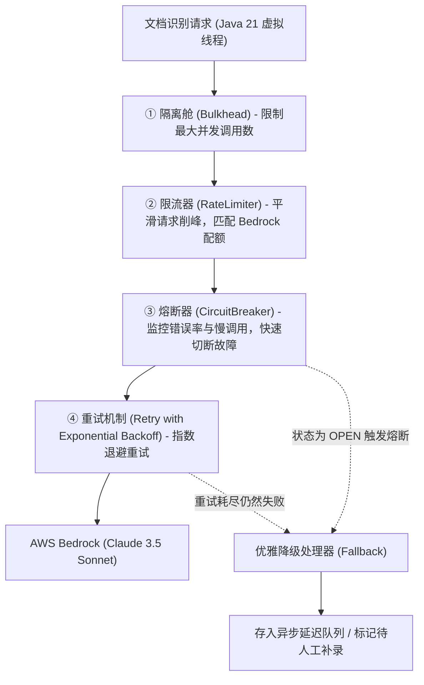
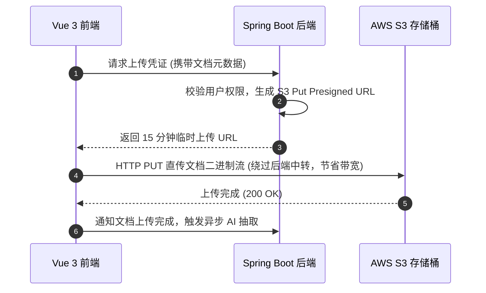

# 高可用防御性架构：Resilience4j 熔断降级实战与 AWS CloudFormation / ECS 交付

在任何将生成式 AI（Generative AI）深度集成到核心业务流的系统中，外部大模型 API 都是最大的**“不确定性来源”**。

面对大模型 API 的**偶发性限流（HTTP 429 Too Many Requests）、推理超时抖动、上游服务降级（HTTP 503）**，如果后端直接裸调接口，瞬间的高并发流量极易引发级联故障（Cascading Failure），导致整个系统服务雪崩。

作为本专栏的收官篇，本文将深入生产高可用实战，解密如何利用 **Resilience4j** 构筑钢铁般的防御性防线，并通过 **AWS CloudFormation (IaC) + ECS Fargate** 完成云原生交付。

---

## 1. 对抗大模型 API 不确定性的四重防御阵线

我们基于 **Resilience4j** 构建了层层递进的四重容错机制：



---

## 2. Spring Boot 3.5 + Resilience4j 生产级配置调优

在 `application.yml` 中进行细粒度参数调优，实现慢调用熔断、指数退避抖动与并发隔离：

```yaml
resilience4j:
  circuitbreaker:
    instances:
      bedrockOcr:
        sliding-window-type: COUNT_BASED
        sliding-window-size: 20                  # 滑动窗口样本量
        minimum-number-of-calls: 10              # 计算错误率的最小调用数
        failure-rate-threshold: 50.0             # 失败率达到 50% 立即触发熔断
        slow-call-rate-threshold: 70.0           # 慢调用率达到 70% 触发熔断
        slow-call-duration-threshold: 8000ms     # 超过 8 秒视为慢调用
        wait-duration-in-open-state: 30000ms     # 熔断开启后等待 30 秒进入半开状态
        permitted-number-of-calls-in-half-open-state: 5
        automatic-transition-from-open-to-half-open-enabled: true
  ratelimiter:
    instances:
      bedrockOcr:
        limit-for-period: 50                     # 每周期允许的最大请求数 (对齐 AWS Bedrock 配额)
        limit-refresh-period: 1s                 # 配额刷新周期
        timeout-duration: 5000ms                 # 排队等待超时时间
  retry:
    instances:
      bedrockOcr:
        max-attempts: 3                          # 最大重试 3 次
        wait-duration: 1500ms                    # 初始重试间隔
        enable-exponential-backoff: true         # 开启指数退避 (1.5s, 3s, 6s)
        exponential-backoff-multiplier: 2.0
        randomize-wait-factor: 0.5               # 注入随机抖动 (Jitter)，防止惊群效应
        retry-exceptions:
          - software.amazon.awssdk.services.bedrockruntime.model.ThrottlingException
          - software.amazon.awssdk.core.exception.ApiCallTimeoutException
  bulkhead:
    instances:
      bedrockOcr:
        max-concurrent-calls: 30                 # 隔离舱最大并发数，保护本地内存
        max-wait-duration: 2000ms
```

---

## 3. S3 预签名 URL（Presigned URL）安全流转设计

为了保证企业敏感单据的安全性，前端**绝不直接持有长期有效的 AWS AccessKey**，也不通过后端应用服务器反复中转巨大的 PDF 二进制流：
1. **上传阶段**：后端生成有效时间为 15 分钟的 `S3 PUT Presigned URL`，前端直传 S3；
2. **审查阶段**：审查员打开 Vue 3 工作台时，后端动态签发仅当前用户可访问的 `S3 GET Presigned URL`（有效期 5 分钟），利用浏览器原生安全沙箱直接从 S3 CDN 边沿拉取渲染。



---

## 4. 云原生交付：AWS CloudFormation (IaC) 与 ECS Fargate

为了实现“基础设施即代码（IaC）”与可复现的自动化交付，我们使用 **AWS CloudFormation** 编排整个微服务集群。

### 4.1 ECS Fargate Task Definition 核心模板片段

```yaml
AWSTemplateFormatVersion: '2010-09-09'
Description: 'IDP Intelligent Document Processing - Production ECS Fargate Stack'

Resources:
  # 1. ECS 无服务器集群
  IdpEcsCluster:
    Type: AWS::ECS::Cluster
    Properties:
      ClusterName: idp-production-cluster
      CapacityProviders:
        - FARGATE
        - FARGATE_SPOT

  # 2. 任务执行角色 (Task IAM Role)
  IdpTaskExecutionRole:
    Type: AWS::IAM::Role
    Properties:
      AssumeRolePolicyDocument:
        Statement:
          - Effect: Allow
            Principal:
              Service: ecs-tasks.amazonaws.com
            Action: sts:AssumeRole
      ManagedPolicyArns:
        - arn:aws:iam::aws:policy/service-role/AmazonECSTaskExecutionRolePolicy

  # 3. 业务运行角色 (授权访问 Bedrock 与 S3)
  IdpTaskAppRole:
    Type: AWS::IAM::Role
    Properties:
      AssumeRolePolicyDocument:
        Statement:
          - Effect: Allow
            Principal:
              Service: ecs-tasks.amazonaws.com
            Action: sts:AssumeRole
      Policies:
        - PolicyName: IdpBedrockS3Access
          PolicyDocument:
            Statement:
              - Effect: Allow
                Action:
                  - bedrock:InvokeModel
                  - bedrock:InvokeModelWithResponseStream
                Resource: '*'
              - Effect: Allow
                Action:
                  - s3:GetObject
                  - s3:PutObject
                Resource: 'arn:aws:s3:::idp-production-docs/*'

  # 4. Fargate 任务定义
  IdpBackendTaskDef:
    Type: AWS::ECS::TaskDefinition
    Properties:
      Family: idp-backend-service
      Cpu: '2048'          # 2 vCPU
      Memory: '4096'       # 4 GB
      NetworkMode: awsvpc
      RequiresCompatibilities:
        - FARGATE
      ExecutionRoleArn: !GetAtt IdpTaskExecutionRole.Arn
      TaskRoleArn: !GetAtt IdpTaskAppRole.Arn
      ContainerDefinitions:
        - Name: idp-backend
          Image: !Sub '${AWS::AccountId}.dkr.ecr.${AWS::Region}.amazonaws.com/idp-backend:latest'
          Essential: true
          PortMappings:
            - ContainerPort: 8080
          Environment:
            - Name: SPRING_PROFILES_ACTIVE
              Value: prod
            - Name: JAVA_TOOL_OPTIONS
              Value: '-XX:+UseZGC -XX:+ZGenerational'  # 启用 Java 21 分代 ZGC 保证极低停顿
          LogConfiguration:
            LogDriver: awslogs
            Options:
              awslogs-group: /ecs/idp-backend
              awslogs-region: !Ref 'AWS::Region'
              awslogs-stream-prefix: ecs
```

---

## 5. 专栏全景复盘与架构路线回顾

通过本专栏共 6 篇体系化的技术长文，我们完整走过了企业级 AI-OCR 智能体的全生命周期：

```mermaid
flowchart TD
    Root["企业级多模态 AI-OCR 全栈体系"]

    Root --> Base["底座与管线"]
    Root --> Agent["智能体中枢"]
    Root --> Trust["可信与自愈"]
    Root --> Eng["全栈与工程化"]

    Base --> B1["Java 21 虚拟线程与结构化并发"]
    Base --> B2["BaseDocumentController 模板抽象"]
    Base --> B3["混合分流路由 Hybrid Router"]
    Base --> B4["300 DPI 渲染与 Dynamic High-Res Tiling"]

    Agent --> A1["AWS Bedrock SDK v2 集成"]
    Agent --> A2["Claude 3.5 视觉多模态抽取"]
    Agent --> A3["Tool Calling JSON Schema 模式硬约束"]
    Agent --> A4["防幻觉空间提示词工程"]

    Trust --> T1["AOP 声明式业务一致性校验器"]
    Trust --> T2["Agentic Reflection Loop 自我反思纠错回路"]
    Trust --> T3["多维置信度量化评分模型"]

    Eng --> E1["Vue 3.5 + Pinia 状态管理"]
    Eng --> E2["pdfjs-dist Web Worker 离屏渲染与虚拟滚动"]
    Eng --> E3["Canvas Bounding Box 空间坐标双向联动"]
    Eng --> E4["Resilience4j 熔断/限流/重试/隔离舱防线"]
    Eng --> E5["S3 预签名安全流转与 ECS Fargate IaC 交付"]
```



这一套架构不仅攻克了文档自动化识别中的准确率与泛化性瓶颈，更展现了**将现代 Java 21 高性能后端、Vue 3.5 现代化前端与前沿生成式 AI 技术紧密结合的工程范式**。希望本专栏能为你的企业级智能文档系统架构设计提供坚实的参考与启发！
