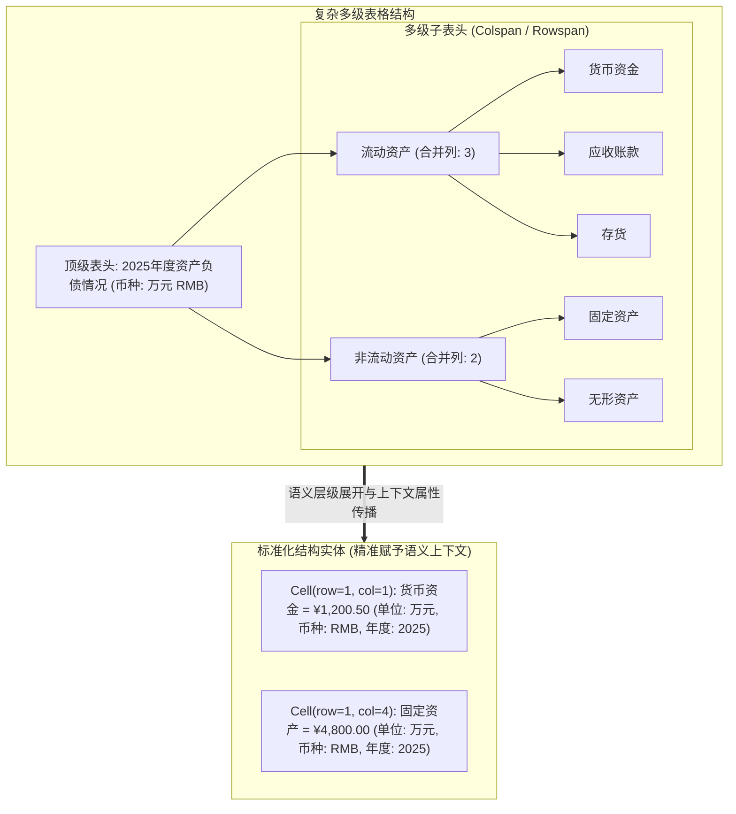
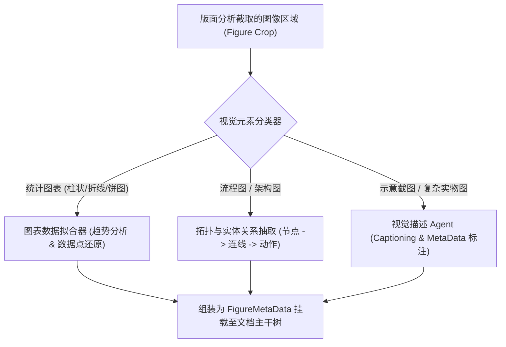

# 企业级 AI-OCR #6：复杂表格与视觉元素多模态处理

在企业级商业报告、财务报表、工程规范与合同文档中，最核心的业务价值往往沉淀在两类复杂媒介中：**复杂层级表格（Complex Tables）** 与 **图表/插图（Visual Figures & Diagrams）**。

传统的 OCR 往往将表格降级为纯文本行或简单的二维矩阵，导致合并单元格错位、表头从属关系断裂；更致命的是，若表格顶部的“单位：万元”、“币种：USD”、“所属年度：2025”等全局属性未能绑定到每个具体单元格，下游系统拿到的就只是一堆毫无业务意义的裸数字。

此外，文档中嵌入的流程图、拓扑架构图、趋势柱状图或局部示意截图若直接被丢弃，将造成关键事实情报的永久丢失。

本文将深入解析如何对复杂表格进行语义级结构化，以及如何将嵌入式视觉元素无缝接入多模态 Agent 工具链。

---

## 1. 复杂表格的工程挑战与结构化建模

复杂表格不仅具备二维几何坐标，更具备深度树状语义拓扑：



### 1.1 表格单元格标准化模型设计

为了让每个数据点都具备完整的自解释能力，我们将表格单元格抽象为强类型 Record：

```java
package com.idp.engine.table.model;

import java.math.BigDecimal;
import java.util.List;

public record TableCell(
    int rowIndex,
    int colIndex,
    int rowSpan,
    int colSpan,
    String rawText,
    BigDecimal numericValue,
    String currency,       // 币种: "USD", "RMB", "EUR"
    String unit,           // 单位: "万元", "kg", "pcs"
    String periodYear,     // 所属年份/周期: "2025"
    List<String> headerPath // 多级表头归属路径: ["流动资产", "货币资金"]
) {}

public record StructuredTable(
    String tableId,
    int pageIndex,
    String caption,
    List<String> globalCurrencies,
    List<String> globalUnits,
    List<TableCell> cells
) {}
```

---

## 2. 表头层级解析与上下文语义向下传播算法

在很多工业单据中，“单位：千克”或“币种：EUR”通常只打印在表格右上角或首行注释中。我们通过**语义上下文传播算法（Context Propagation）**将全局属性自动继承至每个单元格：

```java
package com.idp.engine.table;

import com.idp.engine.table.model.TableCell;
import org.springframework.stereotype.Component;

import java.util.ArrayList;
import java.util.List;

@Component
public class TableSemanticContextPropagator {

    /**
     * 将表格全局元数据 (币种、单位、年份) 传播至所有子项数据单元格
     */
    public List<TableCell> propagateContext(List<TableCell> rawCells, String defaultCurrency, String defaultUnit, String defaultYear) {
        List<TableCell> enrichedCells = new ArrayList<>();

        for (TableCell cell : rawCells) {
            // 若单元格自身未声明特定币种，自动继承全局默认值
            String resolvedCurrency = (cell.currency() != null && !cell.currency().isBlank()) 
                    ? cell.currency() 
                    : defaultCurrency;

            String resolvedUnit = (cell.unit() != null && !cell.unit().isBlank()) 
                    ? cell.unit() 
                    : defaultUnit;

            String resolvedYear = (cell.periodYear() != null && !cell.periodYear().isBlank()) 
                    ? cell.periodYear() 
                    : defaultYear;

            enrichedCells.add(new TableCell(
                cell.rowIndex(),
                cell.colIndex(),
                cell.rowSpan(),
                cell.colSpan(),
                cell.rawText(),
                cell.numericValue(),
                resolvedCurrency,
                resolvedUnit,
                resolvedYear,
                cell.headerPath()
            ));
        }

        return enrichedCells;
    }
}
```

---

## 3. 表格与文档中视觉元素的多模态处理

文档中常常穿插着**业务流程图、网络拓扑架构图、柱状/折线趋势图或局部屏幕截图**。这些元素无法通过纯字符 OCR 处理，必须走多模态理解管线。



### 3.1 实体关系与流程图元数据提取

对于流程图和架构图，智能体不仅生成自然语言描述，更提取出**实体-关系三元组（Entity-Relation Triples）**：

```json
{
  "figureId": "FIG_PAGE_04_01",
  "figureType": "FLOW_CHART",
  "caption": "质量检验审批流转流程图",
  "entities": [
    { "id": "E1", "name": "样品入库检验", "type": "STEP" },
    { "id": "E2", "name": "实验室化验分析", "type": "STEP" },
    { "id": "E3", "name": "质量总监放行签批", "type": "GATEWAY" }
  ],
  "relations": [
    { "from": "E1", "to": "E2", "condition": "物理指标合格" },
    { "from": "E2", "to": "E3", "condition": "化验纯度 >= 99.5%" }
  ]
}
```

---

## 4. 多模态 Agent Tool 工具化封装

在复杂智能体编排中，我们将“局部高清截图识别与细节放大”封装为标准的 **Agent Tool**，允许主大模型在推理过程中按需自主触发调用：

```java
package com.idp.engine.agent.tool;

import com.fasterxml.jackson.databind.JsonNode;
import com.fasterxml.jackson.databind.ObjectMapper;
import com.idp.engine.agent.BedrockVisionExtractor;
import org.springframework.stereotype.Component;

import java.util.List;
import java.util.Map;

/**
 * 供 Vision Agent 在主推理过程中按需调用的图表/细节放大工具
 */
@Component
public class DiagramInspectorTool {

    private final BedrockVisionExtractor visionExtractor;
    private final ObjectMapper objectMapper;

    public DiagramInspectorTool(BedrockVisionExtractor visionExtractor, ObjectMapper objectMapper) {
        this.visionExtractor = visionExtractor;
        this.objectMapper = objectMapper;
    }

    /**
     * 工具定义描述，注入大模型的 tools 列表
     */
    public Map<String, Object> getToolSpecification() {
        return Map.of(
            "name", "inspect_diagram_or_figure",
            "description", "对文档中的复杂图表、拓扑图、流程图或局部微小细节截图进行高精度多模态深入解析",
            "input_schema", Map.of(
                "type", "object",
                "properties", Map.of(
                    "figureIndex", Map.of("type", "integer", "description", "目标图表的索引编号"),
                    "extractionGoal", Map.of("type", "string", "description", "分析目标，如 '提取流程分支节点' 或 '读取柱状图2025年数值'")
                ),
                "required", List.of("figureIndex", "extractionGoal")
            )
        );
    }

    /**
     * 工具执行逻辑
     */
    public JsonNode executeInspection(byte[] cropImageBytes, String extractionGoal) {
        Map<String, Object> diagramSchema = Map.of(
            "type", "object",
            "properties", Map.of(
                "description", Map.of("type", "string"),
                "extractedEntities", Map.of("type", "array", "items", Map.of("type", "string")),
                "numericObservations", Map.of("type", "object")
            ),
            "required", List.of("description")
        );

        return visionExtractor.extractStructuredData(cropImageBytes, "image/png", diagramSchema);
    }
}
```

---

## 5. 小结与下篇预告

通过对**复杂表格的层级化建模、上下文属性传播**以及**视觉元素的多模态工具化封装**，系统成功攻克了：
1. **表格语义保真**：彻底消除合并单元格错位与表头歧义，让裸数字具备年份、币种与度量单位；
2. **多模态图表可解释**：将流程图、架构图与统计趋势转化为机器可读的实体关系图谱。

然而，在处理数十页甚至数百页的长篇单据与报表时，我们将不可避免地遭遇大模型的**上下文窗口上限（Context Window Limit）**与**输出 Token 截断**问题。

在下一篇文章 **《上下文窗口管理与截断防御：Token 经济学、滑窗合并与断点续传》** 中，我们将深入剖析长文档的 Token 预算管理、截断自动检测与无缝断点续传机制！
