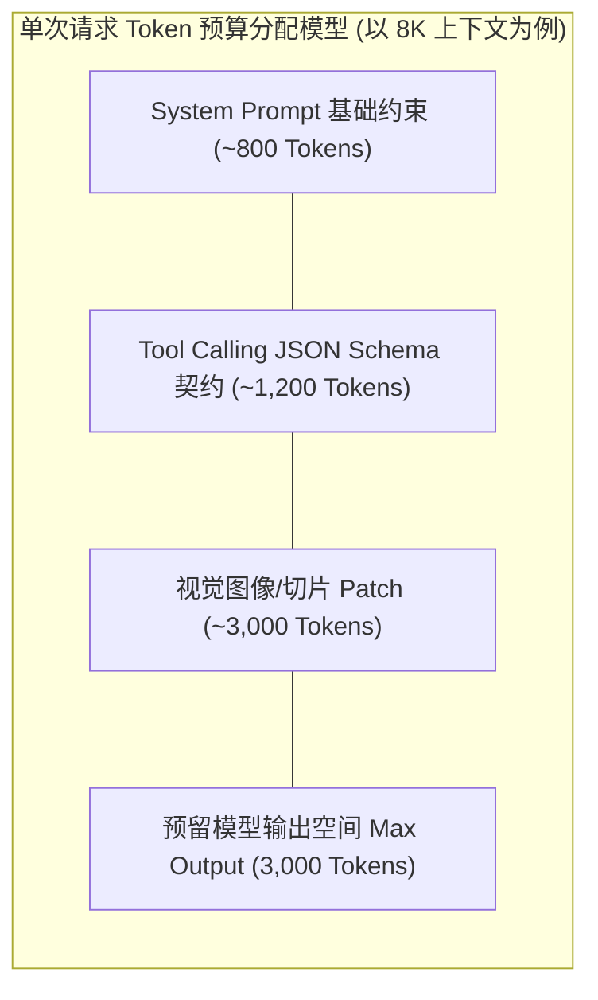
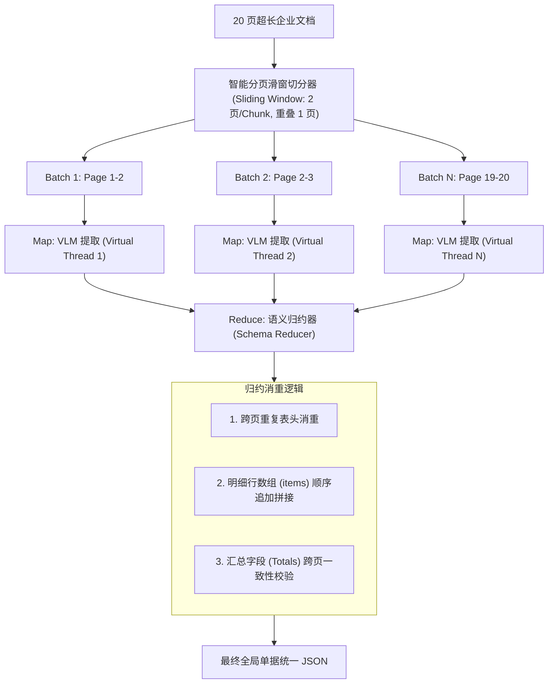
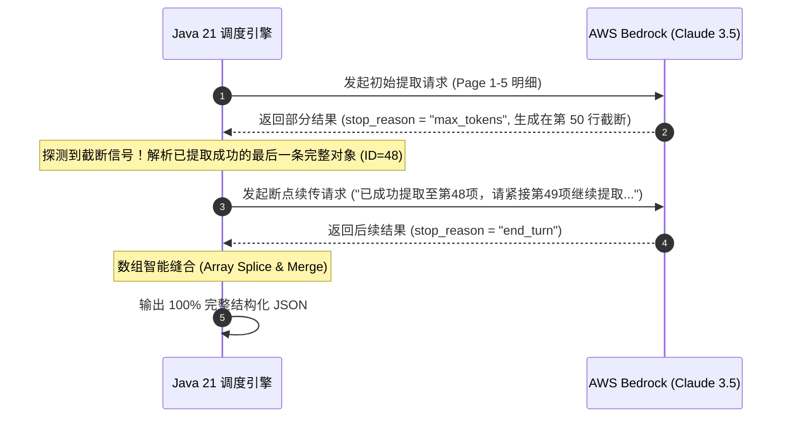

# 上下文窗口管理与截断防御：Token 经济学、滑窗合并与断点续传

在将多模态大模型应用于企业级长文档处理时，工程师经常会遭遇两堵“物理高墙”：
1. **输入端限制（Input Limits）**：超长文档（如数十页合同或上百页报表）若一次性传入全部高清图片，会瞬间打爆模型的输入上下文窗口或触发云服务商单次请求 Payload 上限（如 AWS Bedrock 25MB 限制），并产生惊人的 Token 账单；
2. **输出端截断（Output Truncation）**：主流模型在单次生成中均有硬性最大输出 Token 限制（如 4096 或 8192 Tokens）。当文档中包含成百上千条明细行时，模型输出的 JSON 会在某个中途突然“腰斩截断”，导致整体 JSON 语法损坏、反序列化彻底崩溃。

如何构建一套兼具 **成本经济性** 与 **防截断韧性** 的上下文管理中枢？本文将系统解构长文档的分块提取、滑窗合并与断点续传工程实现。

---

## 1. 大模型物理约束与 Token 预算分配（Token Budgeting）

为了保证流水线稳定运行，系统必须对每一次模型调用的 Token 配额进行严格的**预算预估与分配**：



### 1.1 图像 Token 开销估算模型
在主流视觉 Transformer（ViT）中，单张图像消耗的 Token 数与图像分辨率直接挂钩：
$$\text{Tokens}_{image} = \left\lceil \frac{W}{28} \right\rceil \times \left\lceil \frac{H}{28} \right\rceil + \text{Base Overhead}$$

一张 $1024 \times 1024$ 的局部切片约消耗 **1,600 Tokens**。因此，单次请求绝不能盲目叠加超过 4 张高清切片，必须实施**分页分块调度**。

---

## 2. 超长文档的 Map-Reduce 并发提取流水线

对于多达数十页的长篇文档，采用 **Map-Reduce 范式** 配合 Java 21 虚拟线程：



---

## 3. 输出截断自动检测与断点续传（Continuation Prompting）

### 3.1 截断现象与状态检测
当模型生成的结构化数据量超出 `max_tokens` 时，Bedrock 返回的响应中 `stop_reason` 会被标记为 `"max_tokens"` 而非正常结束的 `"end_turn"` 或 `"tool_use"`。

此时返回的字符串通常在中间断裂（例如 `{"item_id": 89, "price": 12`）。直接解析会抛出 `JsonParseException: Unexpected end-of-input`。



### 3.2 截断自动恢复与续传实现

```java
package com.idp.engine.agent;

import com.fasterxml.jackson.databind.JsonNode;
import com.fasterxml.jackson.databind.ObjectMapper;
import com.fasterxml.jackson.databind.node.ArrayNode;
import com.fasterxml.jackson.databind.node.ObjectNode;
import org.slf4j.Logger;
import org.slf4j.LoggerFactory;
import org.springframework.stereotype.Component;

import java.util.Map;

@Component
public class TruncationRecoveryManager {

    private static final Logger log = LoggerFactory.getLogger(TruncationRecoveryManager.class);
    private static final String STOP_REASON_MAX_TOKENS = "max_tokens";

    private final ObjectMapper objectMapper;

    public TruncationRecoveryManager(ObjectMapper objectMapper) {
        this.objectMapper = objectMapper;
    }

    /**
     * 判断响应是否发生输出截断
     */
    public boolean isTruncated(String stopReason) {
        return STOP_REASON_MAX_TOKENS.equalsIgnoreCase(stopReason);
    }

    /**
     * 构建断点续传提示词
     */
    public String buildContinuationPrompt(int lastExtractedIndex, String lastItemKey) {
        return String.format(
            "上一次输出因达到 Token 上限截断。当前已完整解析至第 %d 项（标识键：%s）。" +
            "请严格紧接该项之后，继续提取剩余未完成的明细项，并保持相同的 JSON Schema 结构。",
            lastExtractedIndex, lastItemKey
        );
    }

    /**
     * 将两段截断数据平滑缝合
     */
    public JsonNode stitchTruncatedArrays(JsonNode primaryPart, JsonNode continuationPart, String arrayFieldName) {
        if (!primaryPart.has(arrayFieldName) || !continuationPart.has(arrayFieldName)) {
            return primaryPart;
        }

        ObjectNode mergedRoot = primaryPart.deepCopy();
        ArrayNode targetArray = (ArrayNode) mergedRoot.get(arrayFieldName);
        ArrayNode continuationArray = (ArrayNode) continuationPart.get(arrayFieldName);

        for (JsonNode item : continuationArray) {
            targetArray.add(item);
        }

        log.info("成功缝合截断数组: 原有 {} 项 + 续传 {} 项 = 共 {} 项", 
                 primaryPart.get(arrayFieldName).size(), continuationArray.size(), targetArray.size());

        return mergedRoot;
    }
}
```

---

## 4. 滑窗消重与全局汇总归约算法

在进行相邻页面滑窗（如 Window 1: Page 1-2, Window 2: Page 2-3）时，Page 2 的数据会被重复提取两次。系统通过**唯一业务主键指纹（Composite Business Key）**在 Reduce 阶段进行自动去重：

```java
package com.idp.engine.agent;

import com.fasterxml.jackson.databind.JsonNode;
import com.fasterxml.jackson.databind.node.ArrayNode;
import com.fasterxml.jackson.databind.node.JsonNodeFactory;
import org.springframework.stereotype.Component;

import java.util.*;

@Component
public class SlidingWindowArrayDeduplicator {

    /**
     * 基于组合指纹对滑窗提取的重叠子项进行精准消重
     */
    public ArrayNode deduplicateItems(List<JsonNode> windowItemArrays, List<String> uniqueKeyFields) {
        ArrayNode unifiedArray = JsonNodeFactory.instance.arrayNode();
        Set<String> seenFingerprints = new HashSet<>();

        for (JsonNode arrayNode : windowItemArrays) {
            if (arrayNode == null || !arrayNode.isArray()) continue;

            for (JsonNode item : arrayNode) {
                String fingerprint = buildFingerprint(item, uniqueKeyFields);
                if (seenFingerprints.add(fingerprint)) {
                    unifiedArray.add(item);
                }
            }
        }

        return unifiedArray;
    }

    private String buildFingerprint(JsonNode item, List<String> uniqueKeyFields) {
        StringBuilder sb = new StringBuilder();
        for (String field : uniqueKeyFields) {
            sb.append(item.path(field).asText("")).append("||");
        }
        return sb.toString();
    }
}
```

---

## 5. 小结与下篇预告

通过构建 **Token 预算管理、Map-Reduce 分页提取、截断自动感知续传与滑窗消重归约**，系统彻底攻克了大模型在处理数十页超长文档时的物理限制，保证了 100% 的数据完整度与吞吐可用性。

现在，我们已经具备了从长文档中稳定抽取完整数据的能力。但在实际业务中，大模型提取的数据是否绝对正确？如果出现金额微小偏差，系统如何感知并自愈？

在下一篇文章 **《Agentic 校验闭环：可信规则引擎、自我反思纠错（Self-Correction）与置信度量化》** 中，我们将深入剖析智能体的自我反思自愈（Reflection Loop）机制！
