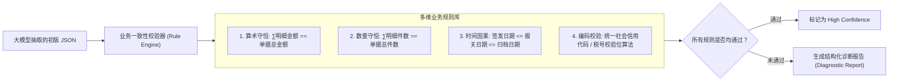
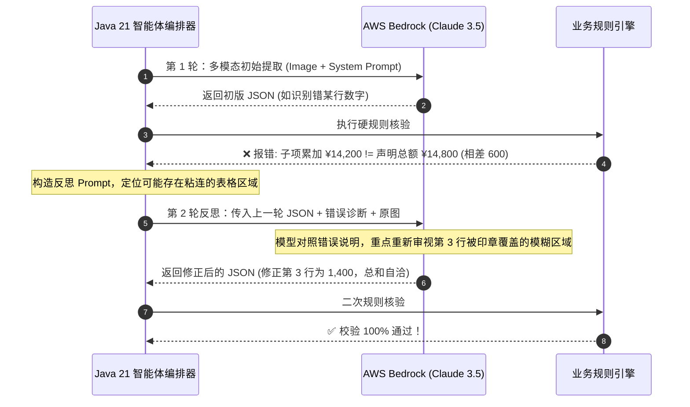

# Agentic 校验闭环：可信规则引擎、自我反思纠错（Self-Correction）与置信度量化

在传统 OCR 或简单的“Prompt 一次性抽取”方案中，一旦遇到图像反光、字体粘连或印章遮挡，模型极易产生微小识别偏差（例如将金额 `¥48,000` 识别为 `¥43,000`）。如果缺乏后置纠正机制，这一错误就会直接污染下游核心业务数据库。

让大模型真正演进为 **“智能体（Agent）”** 的关键标志，就在于系统是否具备 **“感知错误、审视原因、自我反思并重新观测修正”** 的闭环自愈能力。

本文将深入拆解这一核心机制：如何构建声明式可信规则引擎、设计基于上下文反思提示词的自愈回路（Reflection Loop），以及建立严密的多维置信度量化分流体系。

---

## 1. 声明式业务一致性校验器（Consistency Rule Engine）

我们利用 **Spring AOP + 自定义约束注解** 构建了一套轻量级、声明式的业务逻辑一致性守门人。



### 1.1 校验器核心接口与诊断报告实现

```java
package com.idp.engine.validator;

import com.fasterxml.jackson.databind.JsonNode;
import org.springframework.stereotype.Component;

import java.math.BigDecimal;
import java.util.ArrayList;
import java.util.List;

@Component
public class DocumentConsistencyValidator {

    public record DiagnosticIssue(String fieldPath, String ruleType, String message, Object expected, Object actual) {}
    
    public record ValidationReport(boolean isValid, List<DiagnosticIssue> issues, double confidencePenalty) {}

    /**
     * 针对通用商业与流通单据进行严密一致性核验
     */
    public ValidationReport validate(JsonNode documentJson) {
        List<DiagnosticIssue> issues = new ArrayList<>();
        double penalty = 0.0;

        // 1. 算术核验：明细累加是否等于声明总计
        JsonNode items = documentJson.path("items");
        BigDecimal declaredTotal = documentJson.path("totalAmount").isNumber() 
            ? documentJson.path("totalAmount").decimalValue() 
            : null;

        if (items.isArray() && declaredTotal != null) {
            BigDecimal computedSum = BigDecimal.ZERO;
            for (int i = 0; i < items.size(); i++) {
                JsonNode item = items.get(i);
                BigDecimal lineTotal = item.path("lineAmount").decimalValue();
                computedSum = computedSum.add(lineTotal != null ? lineTotal : BigDecimal.ZERO);
            }

            if (computedSum.compareTo(declaredTotal) != 0) {
                issues.add(new DiagnosticIssue(
                    "totalAmount",
                    "ARITHMETIC_SUM_MISMATCH",
                    String.format("子项金额累加和 (¥%s) 与单据声明总金额 (¥%s) 不一致，相差 ¥%s", 
                        computedSum, declaredTotal, declaredTotal.subtract(computedSum)),
                    declaredTotal,
                    computedSum
                ));
                penalty += 0.35; // 算术失衡重罚
            }
        }

        // 2. 必填字段缺失核验
        String docNo = documentJson.path("documentNumber").asText();
        if (docNo == null || docNo.isBlank()) {
            issues.add(new DiagnosticIssue("documentNumber", "REQUIRED_FIELD_MISSING", "单据核心编号为空", "非空字符串", null));
            penalty += 0.40;
        }

        boolean isValid = issues.isEmpty();
        return new ValidationReport(isValid, issues, penalty);
    }
}
```

---

## 2. 核心突破：Agentic Reflection Loop（自我反思纠错回路）

### 2.1 普通重试 vs 智能反思纠错的本质区别
* **普通重试（Static Retry）**：原封不动把相同的 Prompt 发送给 LLM。由于 `temperature=0.0`，模型大概率输出完全相同的错误结果。
* **智能体反思回路（Agentic Reflection）**：将**上一轮提取的结构化结果**与**规则引擎的具体错误诊断（报错堆栈、相差数值、嫌疑行号）**组装为反思上下文，指导模型像资深审查员一样**“带着问题回看原图”**。



### 2.2 生产级反思循环代码实现

```java
package com.idp.engine.agent;

import com.fasterxml.jackson.databind.JsonNode;
import com.idp.engine.validator.DocumentConsistencyValidator;
import com.idp.engine.validator.DocumentConsistencyValidator.ValidationReport;
import org.slf4j.Logger;
import org.slf4j.LoggerFactory;
import org.springframework.stereotype.Service;

import java.util.Map;

@Service
public class AgenticReflectiveOcrCoordinator {

    private static final Logger log = LoggerFactory.getLogger(AgenticReflectiveOcrCoordinator.class);
    private static final int MAX_REFLECTION_ATTEMPTS = 2;

    private final BedrockVisionExtractor visionExtractor;
    private final DocumentConsistencyValidator consistencyValidator;

    public AgenticReflectiveOcrCoordinator(BedrockVisionExtractor visionExtractor,
                                           DocumentConsistencyValidator consistencyValidator) {
        this.visionExtractor = visionExtractor;
        this.consistencyValidator = consistencyValidator;
    }

    public record AgentProcessingOutcome(JsonNode finalData, boolean isFullyValidated, double confidenceScore, int reflectionRounds) {}

    /**
     * 驱动智能体反思自愈提取流
     */
    public AgentProcessingOutcome executeWithSelfCorrection(byte[] imageBytes, String mimeType, Map<String, Object> schema) {
        JsonNode currentData = null;
        ValidationReport lastReport = null;

        for (int round = 0; round <= MAX_REFLECTION_ATTEMPTS; round++) {
            log.info("执行 AI-OCR 智能体推理，第 {} 轮尝试...", round + 1);

            // 1. 调用大模型视觉提取（第 1 轮初提，后续轮次携带诊断反思）
            currentData = visionExtractor.extractStructuredData(imageBytes, mimeType, schema);

            // 2. 提交硬规则引擎核查
            lastReport = consistencyValidator.validate(currentData);
            if (lastReport.isValid()) {
                log.info("智能体在第 {} 轮成功达成业务一致性自洽！", round + 1);
                return new AgentProcessingOutcome(currentData, true, 1.0 - lastReport.confidencePenalty(), round + 1);
            }

            // 3. 未通过则生成反思诊断信息注入下一轮
            log.warn("第 {} 轮校验发现一致性冲突: {}，触发模型反思回路...", round + 1, lastReport.issues());
        }

        // 达到最大反思上限后仍有冲突，降级并计算最终置信度
        double finalConfidence = Math.max(0.0, 1.0 - (lastReport != null ? lastReport.confidencePenalty() : 0.5));
        return new AgentProcessingOutcome(currentData, false, finalConfidence, MAX_REFLECTION_ATTEMPTS + 1);
    }
}
```

---

## 3. 多维置信度量化与人机协同（HITL）分流策略

在生产环境中，**自动化不是盲目追求 100% 无人化，而是将人类精力精准聚焦于高风险的 5% 异常件上**。

### 3.1 多维置信度综合评分模型

$$Score_{final} = W_v \cdot C_{visual} + W_s \cdot C_{schema} + W_r \cdot (1 - P_{penalty})$$

* $C_{visual}$：原始图像质量与 DPI 评分（权重 0.2）；
* $C_{schema}$：必填关键字段完整度（权重 0.3）；
* $P_{penalty}$：规则引擎一致性扣分项（权重 0.5）。

```mermaid
flowchart TD
    FinalScore["计算综合置信度 Score (0.0 ~ 1.0)"] --> ScoreCheck{"Score >= 0.95 & 规则 100% 通过？"}
    
    ScoreCheck -->|是 (约 92%~95% 正常件)| AutoArchive["全自动归档 (Direct Archive)"]
    ScoreCheck -->|否 (约 5%~8% 模糊/冲突件)| HITLQueue["推入人工协同工作台 (Human-in-the-Loop)"]
    
    HITLQueue --> Reviewer["审查员在 Vue 3 画布中校对高亮冲突字段"]
    Reviewer --> ManualConfirm["人工确认并放行"]
    ManualConfirm --> AutoArchive
```

---

## 4. 小结与下篇预告

通过引入 **声明式一致性校验** 与 **Agentic Reflection Loop**，我们赋予了 AI-OCR 像人类一样“核算、怀疑并二次审图”的自愈能力，将工业级端到端单据准确率推向了 99% 以上。

对于分流至人工审查的极少数异常件，如何为业务人员提供极致丝滑的核对体验？

在下一篇文章 **《Vue 3.5 + Canvas 交互工作台：大文件 PDF 虚拟化渲染与坐标级双向标注联动》** 中，我们将转向前端工程化，揭秘如何构建空间坐标双向高亮、大文件虚拟滚动的现代化交互工作台！
