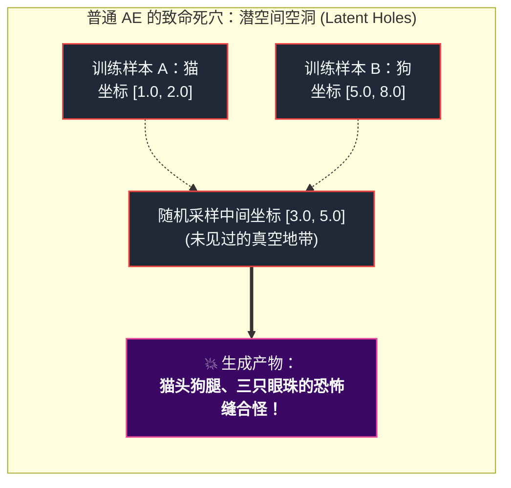
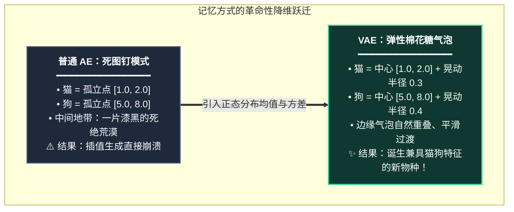
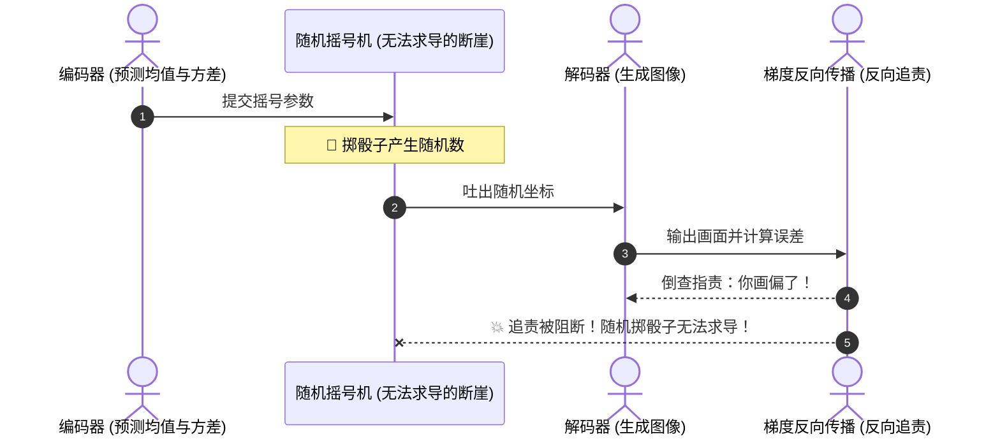

# AI画画的“脱水蔬菜与高斯魔法箱”：三分钟看懂为什么 Stable Diffusion 和 Sora 离不开 VAE

不知道你有没有过这种奇妙的经历：

深夜坐在电脑前，在 WebUI 或者 ComfyUI 里敲下一句看似平常的咒语，轻点“生成”。伴随着显卡风扇突然发出的一阵呼啸，进度条飞速拉满——几秒钟后，屏幕上缓缓浮现出一幅发丝晶莹、光影绝伦的高清画作。

这时候，很多人心里都会忍不住泛起一丝好奇：**AI 到底是在哪儿挥毫泼墨的？**  
它是像一个戴着老花镜的数码画师一样，趴在屏幕上一个像素、一个像素地涂抹红黄蓝吗？

如果你真这么想，那我得先给你泼一盆清醒的冷水：  
**如果 AI 真的趴在像素画布上硬画，你的显卡当场就能用来煎鸡蛋！**

在所有这些看似魔法的生成模型背后，其实都蹲着一个默默干粗活、却一手掌控着画质生死的“幕后总管”——**VAE（变分自编码器，Variational Autoencoder）**。

今天这篇文章，**我不跟你摆任何生硬的公式谱子，也不念半句催眠的学术黑话**。咱们就用厨房里的脱水蔬菜、宜家的打包盒和操场上的班主任，推心置腹地聊明白：这个小东西到底凭什么成了现代 AI 生图与生视频的绝对命门！

---

## 1. 序幕：为什么不能直接在画布（像素）上涂抹？

咱们先来算一笔让人后背发凉的账。

假装你今天要在客厅墙上挂一幅 $1024 \times 1024$ 分辨率的写实壁画。在计算机的底层世界里，这幅画可不是什么艺术品，而是一串冰冷的矩阵：
$$1024 \times 1024 \times 3 (\text{红、绿、蓝三原色}) = 3,145,728 \text{ 个数值！}$$

整整 **314 万个独立的像素数字**！

> [!NOTE]
> **在 300 万颗沙子上绣花的绝望**  
> 现代扩散模型（Diffusion）作画的过程叫“去噪”——从一团完全看不懂的杂乱雪花点开始，一步一步擦除噪点，通常要反反复复推理 20 到 50 轮。  
> 如果让它直接面对这 314 万个数字，就好比**让一位绣娘在一片由 300 万颗细沙组成的沙滩上绣龙袍**。微风稍微吹歪一粒沙子，整张脸的五官就彻底移位了；而且画这么一张图，耗掉的电费和算力足够让任何一家创业公司心疼得直哆嗦！

这时候，聪明绝顶的计算机科学家一拍大腿：  
**“既然直接搬大柜子太蠢，咱们干嘛不学学宜家，搞扁平包装呢？！”**

你想想，你去宜家买一个两米多高的大衣柜，店员绝不可能让你扛着一个笨重的大木架子挤地铁。他们会把木板拆开、压实，整整齐齐码进一个扁平的小纸箱里。

**VAE 在 AI 世界里扮演的，恰恰就是这个“顶级打包拆件大师”：**
1. **压缩打包（编码，Encoder）**：把一张 $1024 \times 1024$ 的庞大画面，抽筋剥髓，剔除人眼根本察觉不到的噪波，体积直接**暴缩 64 倍**，压成一块巴掌大的发光小魔方；
2. **微缩创作（扩散中枢，Diffusion / DiT）**：AI 画师再也不用对着 300 万个像素抓狂了，它只需要在这个小巧玲珑的魔方里专心琢磨构图与光影；
3. **泡发还原（解码，Decoder）**：画作定稿后，扔进解压水槽里一喷，瞬间“彭”地一声泡发还原成毛孔清晰的高清巨幅画卷！

这个被压扁的微缩数字魔方，在数学家口中就叫——**潜空间（Latent Space）**。你看，换成人话，是不是一点都不神秘？

---

## 2. 偏科生的翻车现场：为什么普通“自编码器（AE）”搞不定？

既然只需要“压缩再解压”，为什么计算机科学家不直接用几十年前就发明出来的**普通自编码器（Autoencoder, AE）**，非要在前面加一个怪异的名词——“**变分（Variational）**”呢？

因为普通自编码器是一个**“死记硬背的偏科生”**！

### 普通 AE 的死脑筋逻辑
普通自编码器的思维方式，像极了班上那个只会死刷课后练习题的偏科生。
老师给它的任务是：“我给你一张加菲猫，你给我压成两维坐标 `(1.0, 2.0)`；反过来输入这个坐标，你必须一五一十把加菲猫复原出来。”

这位偏科生为了在期末考试里拿到 100 分，开始了疯狂的**死记硬背**：
- 看到加菲猫，它在草稿纸上钉下一颗死图钉：`(1.0, 2.0)`；
- 看到哈士奇，它在草稿纸上钉下一颗死图钉：`(5.0, 8.0)`。

在它眼里，世界是由几个孤零零的图钉构成的，而在加菲猫和哈士奇之间大片大片的空白海域里，它的脑子里完全是一片虚无！

### 惊悚的翻车现场
我们玩生成式 AI，最迷人的地方不就是**“无中生有、天马行空”**吗？  
我们渴望在猫和狗的坐标中间取一个点 `(3.0, 5.0)`，让 AI 画出一只“既有猫咪的圆脸萌态、又有小狗忠诚眼神”的神奇梦幻生物。

然而，当你满怀期待地把这个坐标敲进去，普通 AE 当场两眼发直，大脑 CPU 瞬间干烧：  
*“等等……课后题里压根没有这个坐标啊！这题超纲了！”*

为了交差，解码器只能闭着眼睛在黑暗中胡乱拼凑：左边硬生生插上一只猫耳朵，右边接上一截狗爪子，中间再糊上一团让人半夜做噩梦的马赛克烂肉——  
在计算机图形学里，这就是让人啼笑皆非又束手无策的**潜空间空洞（Latent Holes）**！

---

## 3. VAE 的点石成金术：把“死图钉”变成“弹性棉花糖”

为了拯救这个偏科生，两位顶级科学家 Kingma 和 Welling 在 2013 年提出了一项改变 AI 命运的创举：**VAE（变分自编码器）**。

> [!TIP]
> **变分（Variational）到底变了什么？**  
> 一句话人话直击本质：**不准给图片记固定的死坐标，必须把它记成一团“允许晃动的概率气泡（高斯分布）”！**

在 VAE 里，当编码器看到加菲猫时，它不能只输出一个坐标数字，而是必须输出两个参数：
1. **均值 $\mu$（气泡的中心）**：大概在 `(1.0, 2.0)` 附近；
2. **方差 $\sigma$（气泡的大小与弹性）**：允许向四周抖动 `0.3`。

这意味着，每次我们去这个气泡里取样，拿到的可能是 `(1.1, 1.9)`，也可能是 `(0.9, 2.1)`。解码器被逼得不得不学会一项新本领：**即使坐标稍微偏一点、抖一下，我也必须能认出它是一只猫！**

当千千万万张图片的“棉花糖气泡”在潜空间里膨胀开来，它们之间原先冰冷的空白荒漠被填满了。当你在猫和狗的气泡交汇处随手一抓，抓到的是一个顺滑的过渡状态，AI 画出的便是一只前所未见却无比逼真的新生物！

---

## 4. 两位幕后护法：海关质检员与巧妙的摇号代金券

但是，事情还没这么简单。如果每个编码器都任性地把自己的棉花糖气泡吹得无限大，或者随便把气泡丢在宇宙的十万八千里之外，潜空间依然会乱成一锅粥。

这时候，VAE 召唤出了它的两位核心“护法神”：

### 护法一：严肃的操场班主任——KL 散度（KL Divergence）

如果放任不管，加菲猫的气泡可能会飘到坐标 `10000`，哈士奇的气泡飘到坐标 `-8888`。扩散模型如果要画画，根本不知道该去哪里找特征。

于是，数学家请来了一位手拿戒尺的班主任——**KL 散度约束**。

班主任一吹哨子：“**所有小气泡听令！无论你们长得多奇特，你们的中心必须向操场正中央（原点 0）靠拢，气泡的弹性必须收缩为标准大小（标准正态分布 $\mathcal{N}(0, 1)$）！**”

- 如果一只猫的气泡想私自逃跑，班主任立刻施加巨额“罚款”（KL 散度损失飙升）；
- 最终，潜空间里的所有气泡都被规整地聚拢在一个紧凑、连续、圆滚滚的“高斯引力球”内。任何时候你想创作，只要在这个引力球里闭着眼睛抓一把，抓出来的都是有意义的艺术宝藏！

---

### 护法二：外包抽盲盒的妙计——重参数化技巧（Reparameterization Trick）

在训练 AI 时，整个流水线靠的是一种叫**反向传播（Backpropagation）**的技术：质检员顺着流水线一路回溯，告诉每个零件该往左拧紧半圈还是往右放松半圈。

但是，VAE 在气泡里“随机摇号抽签”的操作，把流水线卡死了！

> [!WARNING]
> **致命困局：随机性没有导数**  
> 质检员质问：“为什么这一步的坐标是 1.25？”  
> 摇号机耸耸肩：“我刚刚随手掷骰子扔出来的，纯属运气，你问我我问谁？”  
> 质检员当场气绝，反向传播链条彻底断裂，AI 根本无法学习！

计算机科学家们灵机一动，想出了一记载入 AI 史册的“金蝉脱壳之计”：**重参数化技巧（Reparameterization Trick）**。

他们做出了一个极其微小的规则修改：
> “工人不再亲自摇号。我们让上帝在流水线门外摇好一颗均匀的随机骰子 $\epsilon \sim \mathcal{N}(0, 1)$，然后做成一张**代金券**送进厂房。  
> 工人拿到代金券后，只做纯粹的乘法和加法：  
> $$\text{最终坐标} = \text{均值 } \mu + \text{方差 } \sigma \times \text{代金券 } \epsilon$$”

就这么轻轻一变，门内的乘法和加法完全是确定的数学运算，质检员的追责路线一路绿灯直通工人！**随机性被巧妙地踢到了门外，梯度的生命线瞬间全线贯通！**

---

## 5. 核心认知卡片与全景速览

恭喜你！到这里，你已经完全攻克了现代生成式 AI 中最精巧的理论难关。让我们用一张极简卡片，把今天的故事复盘装进脑海：

| 核心组件 | 生活化具象映射 | 核心职责 | ⚠️ 如果失去它会怎样？ |
| :--- | :--- | :--- | :--- |
| **潜空间 (Latent)** | 宜家衣柜扁平纸盒 | 把庞大像素压扁 64 倍，为扩散模型减负 | 显卡显存瞬间被 300 万像素挤爆 OOM |
| **高斯分布 ($\mu, \sigma$)** | 弹性质感的棉花糖 | 给硬点赋予微颤空间，消除未见过的空白缝隙 | 生成“猫头狗身三只眼”的恐怖缝合怪 |
| **KL 散度惩罚** | 操场上的铁面班主任 | 强行把所有特征气泡收拢在原点标准球内 | 特征像无头苍蝇四处乱飞，抽卡全是马赛克 |
| **重参数化技巧** | 门外掷骰子买代金券 | 把随机抽样外挂，打通反向传播梯度的血脉 | 随机不可导，模型根本学不会更新参数 |

---

## 下篇预告：从直觉漫游走向数学流形

今天，我们用脱水蔬菜、棉花糖和班主任的哨子，建立了对 VAE 的底层认知。

但作为一名有追求的开发者或算法工程师，你心里一定还有更深层的疑问：
- 变分下界 ELBO 到底是怎么从贝叶斯公式里一步步推导出来的？
- 为什么均值和方差的拉锯战，在数学上被称作“变分自由能（Variational Free Energy）”？
- 怎么用不到 60 行清晰易读的 PyTorch 代码，亲手写出一个能自由变形数字的极简 VAE？

在 **Part 2《变分自由能与流形拉锯战：VAE 数学推导、重参数化原理与 PyTorch 极简手撕》** 中，我们将撕掉生硬教科书的伪装，用最直观的几何张力视角，带你彻底征服 VAE 的硬核数学灵魂！
