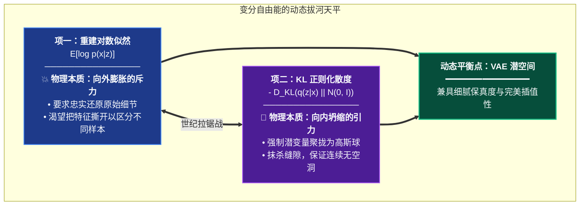
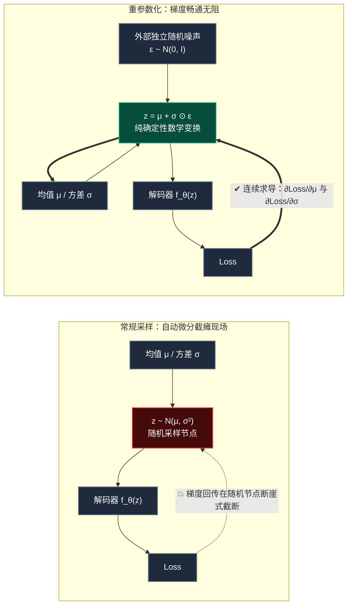

# VAE 全景拆解 #2：变分自由能与流形拉锯战

说句掏心窝子的话：当年我刚入坑深度学习那会儿，每次在生成模型的论文里看到“变分推断（Variational Inference）”和“证据下界（ELBO）”，我的脑仁都会条件反射般地隐隐作痛。

那满屏飞舞的多重积分、条件似然和期望算子，像极了焊死在知识大门前的三重防盗锁。它常常让人产生一种强烈的自我怀疑：明明每一个数学符号上大学时都考过，怎么拼在一块儿就比天书还催眠？

但请你一定要相信我：  
**只要狠狠撕掉那层为了显得“高深莫测”而刻意包装的公式外衣，VAE 的底层思想其实浪漫且优雅得一塌糊涂！**  
它根本不是冷冰冰的数字游戏，而是一场在多维时空里、关于**“渴望保留个性的斥力”与“臣服于规矩的宇宙引力”之间的世纪拔河**！

今天这篇，咱们就把数学教科书扔在一边，用物理张力与几何直觉贯穿全篇。所有的数学推导，我都用最直白的人话给你兜底；文末我还附上了一个不到 60 行、不搞花哨包装、哪怕大二学生也能一遍跑通的极简 PyTorch 手撕模块！

---

## 1. 贝叶斯后验的“绝望之墙”：为什么必须用变分推断？

在生成式 AI 的宇宙里，所有算法都在拼命追逐同一个圣杯：**把现实世界的概率分布 $p(x)$ 给摸透，然后无中生有地源源不断采样出逼真的新样本**。

根据经典贝叶斯定理，如果我们假设每张图像 $x$ 背后都有一个决定它风格、构图的潜在密码 $z$（潜在变量，Latent），那么给定一张图片 $x$，求它的潜在特征分布后验概率为：

$$p(z|x) = \frac{p(x|z) \cdot p(z)}{p(x)}$$


请把目光聚焦在分母 $p(x)$ 上：
为了求出分母，根据全概率公式，我们必须把所有可能的潜在密码 $z$ 全部穷举并积分：
$$p(x) = \int p(x|z) p(z) \, dz$$

> [!CAUTION]
> **大海捞针的不可积之灾（Intractability）**  
> 想象一下，$z$ 是一个 64 维甚至 128 维的高维连续向量空间。如果要把这片汪洋大海里的每一个点都算一遍概率再加起来，就算把全世界的量子计算机加在一起算到宇宙毁灭，也算不完一个积分符号！  
> **这就是贝叶斯统计里著名的“不可积绝望之墙”——真实后验 $p(z|x)$ 永远无法被精确解析计算！**

### 救世主登场：变分推断（Variational Inference, VI）
既然无法硬算，数学家们换了一条极其聪明的思维路径：
> “既然我算不出那个复杂的未知函数 $p(z|x)$，那我就找一个结构极度简单、已知且处处可导的函数族 $q_\phi(z|x)$（比如多维正态分布），然后通过调整参数 $\phi$，**让 $q_\phi(z|x)$ 拼命去拟合、逼近真实的 $p(z|x)$**！”

**把一个算不出来的“积分求解难题”，硬生生转换成了一个计算机最擅长的“梯度下降优化难题”！这就是变分推断的全部精髓！**

---

## 2. 证据下界（ELBO）：一场斥力与引力的世纪拔河

为了让近似分布 $q_\phi(z|x)$ 尽可能贴合真实分布 $p(z|x)$，最自然的度量就是 **KL 散度（Kullback-Leibler Divergence）**。

我们希望最小化两者的距离：$D_{KL}(q_\phi(z|x) \parallel p(z|x))$。

展开推导如下（注意看每一步的变化）：
$$
\begin{aligned}
D_{KL}(q_\phi(z|x) \parallel p(z|x)) &= \mathbb{E}_{q_\phi} \left[ \log \frac{q_\phi(z|x)}{p(z|x)} \right] \\
&= \mathbb{E}_{q_\phi} \left[ \log q_\phi(z|x) - \log p(z, x) + \log p(x) \right]
\end{aligned}
$$

由于 $\log p(x)$ 中不包含随机变量 $z$，它对于期望算子是常数，可以直接提出来：
$$D_{KL}(q_\phi(z|x) \parallel p(z|x)) = \mathbb{E}_{q_\phi} [\log q_\phi(z|x) - \log p(z, x)] + \log p(x)$$

将式子移项整理：
$$\log p(x) = \mathbb{E}_{q_\phi} [\log p(z, x) - \log q_\phi(z|x)] + D_{KL}(q_\phi(z|x) \parallel p(z|x))$$

进一步把联合概率拆解为先验与似然 $p(z, x) = p_\theta(x|z)p(z)$：
$$\log p(x) = \underbrace{\mathbb{E}_{q_\phi(z|x)} [\log p_\theta(x|z)] - D_{KL}(q_\phi(z|x) \parallel p(z))}_{\text{ELBO (证据下界，Evidence Lower Bound)}} + \underbrace{D_{KL}(q_\phi(z|x) \parallel p(z|x))}_{\ge 0}$$

由于任何两个分布之间的 KL 散度天然恒大于等于 0（$D_{KL} \ge 0$），所以第一部分必然构成了对数似然 $\log p(x)$ 的数学下界：

$$\log p(x) \ge \text{ELBO} = \mathbb{E}_{q_\phi(z|x)} [\log p_\theta(x|z)] - D_{KL}(q_\phi(z|x) \parallel p(z))$$



> [!NOTE]
> **物理张力的人话解读**
> - **第一项：重建对数似然（Reconstruction Term）—— 向外膨胀的“斥力”**  
>   它要求解码器必须把输入的猫和狗准确画出来。为了画得准，它恨不得把猫的潜变量放在 $+1000$，狗的潜变量放在 $-1000$，把特征拼命推开。
> - **第二项：KL 散度惩罚（Regularization Term）—— 向中心坍缩的“宇宙引力”**  
>   它像一个引力强大的黑洞，强制要求所有样本的均值必须缩回 0，方差必须等于 1。它想把所有特征捏成一个无差别的混沌球。
> 
> **VAE 的训练过程，就是这两股力量在物理世界中的拔河与博弈！** 当两股力量达到纳什均衡时，潜空间既保留了丰富可辨的语义信息，又具备了平滑连续的概率流形！

---

## 3. 高维对角高斯分布 KL 散度的闭式推导

在实际深度学习工程中，通常假设先验分布是标准多维正态分布：$p(z) = \mathcal{N}(0, I)$；  
而编码器输出的多维正态近似后验为：$q_\phi(z|x) = \mathcal{N}(\mu, \operatorname{diag}(\sigma^2))$。

在这个假设下，KL 散度不需要进行复杂的蒙特卡洛随机估算，而是拥有一个**极具美感的代数闭式解（Closed-form Solution）**！

对于单维度正态分布，两分布的 KL 散度积分为：
$$D_{KL}(q \parallel p) = \int \frac{1}{\sqrt{2\pi\sigma^2}} e^{-\frac{(z-\mu)^2}{2\sigma^2}} \left[ \log \frac{\frac{1}{\sqrt{2\pi\sigma^2}} e^{-\frac{(z-\mu)^2}{2\sigma^2}}}{\frac{1}{\sqrt{2\pi}} e^{-\frac{z^2}{2}}} \right] dz$$

展开对数项：
$$\log \frac{q(z)}{p(z)} = -\frac{1}{2}\log(2\pi\sigma^2) - \frac{(z-\mu)^2}{2\sigma^2} + \frac{1}{2}\log(2\pi) + \frac{z^2}{2} = -\frac{1}{2}\log\sigma^2 - \frac{(z-\mu)^2}{2\sigma^2} + \frac{z^2}{2}$$

对其求数学期望 $\mathbb{E}_{z \sim q}[\cdot]$：
1. $\mathbb{E}\left[-\frac{1}{2}\log\sigma^2\right] = -\frac{1}{2}\log\sigma^2$
2. $\mathbb{E}\left[-\frac{(z-\mu)^2}{2\sigma^2}\right] = -\frac{\sigma^2}{2\sigma^2} = -\frac{1}{2}$
3. $\mathbb{E}\left[\frac{z^2}{2}\right] = \frac{\mathbb{E}[z^2]}{2} = \frac{\mu^2 + \sigma^2}{2}$（利用统计学恒等式 $\mathbb{E}[z^2] = \mu^2 + \sigma^2$）

三项合并求和：
$$D_{KL} = -\frac{1}{2}\log\sigma^2 - \frac{1}{2} + \frac{\mu^2 + \sigma^2}{2} = -\frac{1}{2} \left( 1 + \log\sigma^2 - \mu^2 - \sigma^2 \right)$$

扩展到 $J$ 维对角高斯潜变量空间，最终的损失公式为：

$$\mathcal{L}_{KL} = -\frac{1}{2} \sum_{j=1}^{J} \left( 1 + \log(\sigma_j^2) - \mu_j^2 - \sigma_j^2 \right)$$

> [!TIP]
> **看懂公式里每一项的惩罚含义**  
> - 如果均值偏离原点（$\mu_j \ne 0$），$-\mu_j^2$ 会导致惩罚增加，逼迫均值回中；
> - 如果方差偏离标准大小（$\sigma_j^2 \ne 1$），则 $\log\sigma_j^2 - \sigma_j^2$ 会显著偏离极大值 $-1$，逼迫方差回缩到 1.0；
> - **公式里的每一个减号，都是一把精准丈量潜特征偏离程度的卡尺！**

---

## 4. 计算图接骨手术：重参数化（Reparameterization Trick）

在上一篇中我们提到了“门外代抽盲盒”的比喻。在代码层面，这个操作究竟是如何完成的？



### 核心变换公式
我们将随机采样变量表示为一个**确定性函数**与一个**无参数独立随机噪声**的复合：
$$z = g_\phi(\epsilon, x) = \mu_\phi(x) + \sigma_\phi(x) \odot \epsilon, \quad \epsilon \sim \mathcal{N}(0, I)$$

这样一来，对期望项的导数就可以直接移入算子内部：
$$\nabla_\phi \mathbb{E}_{q_\phi(z|x)} [f(z)] = \mathbb{E}_{p(\epsilon)} \left[ \nabla_\phi f(\mu_\phi(x) + \sigma_\phi(x) \odot \epsilon) \right]$$

利用链式法则求导：
$$\frac{\partial z}{\partial \mu} = 1, \quad \frac{\partial z}{\partial \sigma} = \epsilon$$

**导数有了！梯度不仅可算，而且极其光滑！整个反向传播计算图被彻底打通！**

---

## 5. 极简手撕：60 行可跑的 PyTorch VAE 实现

下面是一个严格按照上述数学公式编写的轻量级 PyTorch VAE 实现。每个张量的形状演变都附带了详细批注，可以直接在本地测试：

```python
import torch
import torch.nn as nn
import torch.nn.functional as F

class MinimalVAE(nn.Module):
    """
    极简工业标准 VAE 结构
    输入尺寸: (B, 1, 28, 28)
    潜在向量维度: latent_dim = 16
    """
    def __init__(self, in_channels: int = 1, latent_dim: int = 16):
        super().__init__()
        self.latent_dim = latent_dim

        # 1. 编码器 (Encoder): 提取高维视觉特征并压平
        self.encoder = nn.Sequential(
            nn.Conv2d(in_channels, 32, kernel_size=3, stride=2, padding=1),  # -> (B, 32, 14, 14)
            nn.ReLU(),
            nn.Conv2d(32, 64, kernel_size=3, stride=2, padding=1),          # -> (B, 64, 7, 7)
            nn.ReLU(),
            nn.Flatten()                                                     # -> (B, 64 * 7 * 7 = 3136)
        )

        # 2. 线性投射层：分别预测高斯分布的均值 (mu) 与对数方差 (log_var)
        self.fc_mu = nn.Linear(64 * 7 * 7, latent_dim)
        self.fc_logvar = nn.Linear(64 * 7 * 7, latent_dim)

        # 3. 解码器前置投射：将潜在向量映射回特征图尺寸
        self.decoder_input = nn.Linear(latent_dim, 64 * 7 * 7)

        # 4. 解码器 (Decoder): 转置卷积反采样还原像素尺寸
        self.decoder = nn.Sequential(
            nn.ConvTranspose2d(64, 32, kernel_size=3, stride=2, padding=1, output_padding=1), # -> (B, 32, 14, 14)
            nn.ReLU(),
            nn.ConvTranspose2d(32, in_channels, kernel_size=3, stride=2, padding=1, output_padding=1), # -> (B, 1, 28, 28)
            nn.Sigmoid()  # 归一化像素值至 [0, 1] 范围
        )

    def reparameterize(self, mu: torch.Tensor, logvar: torch.Tensor) -> torch.Tensor:
        """
        核心精髓：重参数化技巧
        z = mu + std * eps
        注：网络输出 log(sigma^2) 以保证数值稳定性并省去取对数运算
        """
        std = torch.exp(0.5 * logvar)  # std = sqrt(exp(logvar))
        eps = torch.randn_like(std)    # 从外生标准高斯分布采集代金券噪声
        return mu + eps * std

    def forward(self, x: torch.Tensor):
        # 编码阶段
        features = self.encoder(x)
        mu = self.fc_mu(features)
        logvar = self.fc_logvar(features)

        # 重参数化采样
        z = self.reparameterize(mu, logvar)

        # 解码阶段
        x_recon = self.decoder_input(z).view(-1, 64, 7, 7)
        x_recon = self.decoder(x_recon)

        return x_recon, mu, logvar

def vae_loss_function(recon_x: torch.Tensor, x: torch.Tensor, mu: torch.Tensor, logvar: torch.Tensor):
    """
    ELBO 目标函数计算 (取相反数变为最小化损失)
    Loss = 重建损失 (Reconstruction Loss) + 正则化损失 (KL Divergence)
    
    注：此处采用二值交叉熵 (BCE) 是基于伯努利似然假设，适合 MNIST 等归一化在 [0, 1] 的灰度图像；
    若针对自然全彩 RGB 连续图像（高斯似然假设），则将解码器末端 Sigmoid 去除，重建损失换用 MSE 或 L1 损失。
    """
    # 1. 重建损失: 对应 -E_{q}[log p(x|z)]
    recon_loss = F.binary_cross_entropy(recon_x, x, reduction='sum')

    # 2. KL 散度闭式解: 对应 D_KL(q(z|x) || N(0, I))
    # 公式: -0.5 * sum(1 + log(sigma^2) - mu^2 - sigma^2)
    kl_loss = -0.5 * torch.sum(1 + logvar - mu.pow(2) - logvar.exp())

    return recon_loss + kl_loss, recon_loss, kl_loss

# 单元测试验证
if __name__ == '__main__':
    dummy_img = torch.rand(4, 1, 28, 28)
    model = MinimalVAE(in_channels=1, latent_dim=16)
    recon, mu, logvar = model(dummy_img)
    total_loss, r_loss, k_loss = vae_loss_function(recon, dummy_img, mu, logvar)
    print(f"输入图像尺寸: {dummy_img.shape}")
    print(f"潜在均值尺寸: {mu.shape}, 潜在对数方差尺寸: {logvar.shape}")
    print(f"重建图像尺寸: {recon.shape}")
    print(f"总损失 (ELBO Loss): {total_loss.item():.2f} (重建: {r_loss.item():.2f}, KL: {k_loss.item():.2f})")
```

---

## 6. 总结与下篇预告：迈向工业级图像生成

通过严谨的数学推导与 PyTorch 极简实现，我们完成了对 VAE 理论内功的修炼：
- 变分推断将不可求解的积分，转化成了可通过反向传播求解的凸优化下界（ELBO）；
- 重参数化技巧通过变量分离，彻底修补了随机采样的导数断裂难题；
- 重建项与 KL 项的博弈，雕琢出了一个结构优雅、连续平滑的高斯流形。

**但是，如果你直接拿着这套基础 VAE 去跑 $1024 \times 1024$ 的真实写实照片，你会沮丧地发现：生成出来的图片依然是灰蒙蒙、甚至像糊了一层塑料薄膜！**

为什么会这样？
- Stable Diffusion 为什么不采用简单的 MSE 重建损失，而是引入了 PatchGAN 判别器与 LPIPS 感知损失？
- 为什么 SD 1.5 的潜空间必须乘上神秘的 `0.18215`？
- 为什么 2024 年最火的 **Flux.1** 和 **SD3**，不惜牺牲内存，也要把潜空间从 4 通道暴涨到 16 通道？

在 **Part 3《潜空间通道革命：从 SD 1.5 到 Flux.1，VAE 是如何主宰现代生图画质上限的？》** 中，我们将深入工业级实战现场，全面解剖现代生图大模型的隐秘武器！
