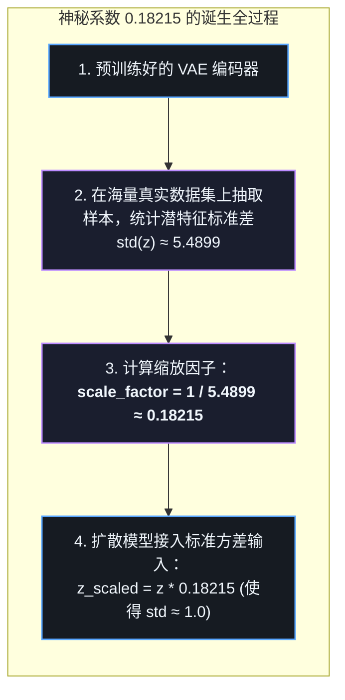
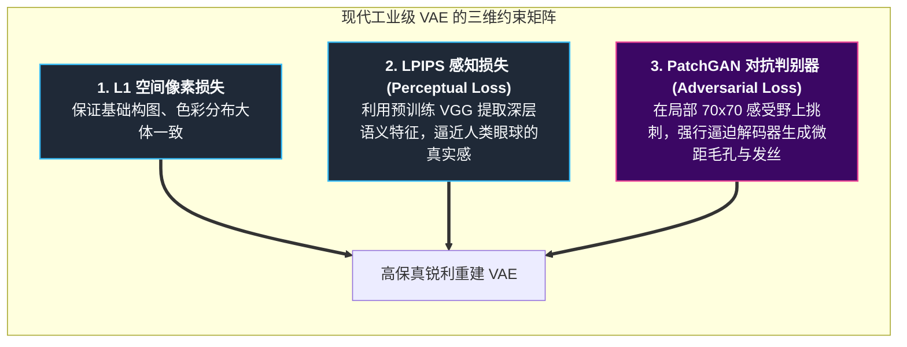
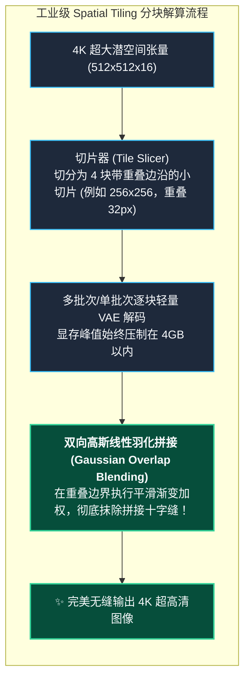

# 潜空间通道革命：从 SD 1.5 到 Flux.1，VAE 是如何主宰现代生图画质上限的？

在当今的开源文生图领域，所有人都在狂热地讨论 DiT（Diffusion Transformer）架构、讨论 12B/14B 的超大参数量、讨论各种炫酷的 LoRA 微调。

然而，几乎所有在生产环境踩过坑的算法工程师和 ComfyUI 资深创作者都会得出一个惊人的一致结论：  
**“无论你的扩散模型脑力多么强大、学到了多少美学知识，最终把画作呈现给人类的视网膜的，是 VAE！VAE 才是决定画质细节与真实感天花板的无名英雄！”**

如果你曾经遇到过：
- 生成远景人像时，脸庞和瞳孔糊成一团融化的烂泥；
- 海报上的英文字母扭曲变形，宛如外星咒语；
- 辛辛苦苦把 DiT 算力优化好了，结果在最后一步 `decode()` 渲染 4K 大图时，显存瞬间爆炸 OOM（Out of Memory）……

那么，你遇到的全部都是 **VAE 的工业工程瓶颈**！

今天，我们将从工程实战的第一视角，拆解从早期 Stable Diffusion 1.5 到 2024 年封神的 **Flux.1**，VAE 经历的通道革命、损失函数蜕变以及大图切片解算的终极工程秘籍！

---

## 1. LDM 两阶段压缩范式：为什么压缩比偏偏是 8 倍？

2022 年，Runway 与慕尼黑大学（CompVis）团队发表了划时代的论文《High-Resolution Image Synthesis with Latent Diffusion Models》（LDM，即 Stable Diffusion 的学术前身）。

这篇论文最核心的洞察，是提出了**两阶段分离范式**：
1. **感知压缩阶段（Perceptual Compression）**：由 VAE 负责。它像一个高保真的数码扫描仪，专门剔除人眼不敏感的高频冗余噪波；
2. **语义生成阶段（Semantic Generation）**：由 UNet / DiT 负责。它在一个干净、抽象的低维空间里专心致志地推演物体的骨架、光影与叙事关系。


### 为什么空间下采样系数偏偏是 $f = 8$？
在 SD 1.5、SD 2.1、SDXL、SD3 以及 Flux.1 中，潜空间几乎清一色地采用了 **8 倍下采样（$f=8$）**。也就是说：
一张 $1024 \times 1024$ 的真实图像，经过 VAE 编码后，潜空间张量的高度和宽度被精确压缩为 $128 \times 128$。

**面积整整缩小了 $8 \times 8 = 64$ 倍！**

为什么不做成 $f=4$（压缩 16 倍）或者 $f=32$（压缩 1024 倍）？
- **如果 $f=4$**：潜空间尺寸高达 $256 \times 256$。对于 Transformer 的 Self-Attention 机制来说，计算复杂度是序列长度的平方（$O(N^2)$）。$256 \times 256 = 65,536$ 个 Token，注意力矩阵的显存开销将直接飙升 16 倍，普通显卡根本无法承受！
- **如果 $f=32$**：潜空间尺寸虽然极小（$32 \times 32$），计算速度极快，但空间信息丢失得太狠了。一根细小的睫毛、一片指甲盖在 $32 \times 32$ 的特征图里甚至占不到 0.01 个像素，解码器再神仙也无法凭空还原！

> [!TIP]
> **黄金分割点**  
> $f=8$ 是计算机视觉科学家经过无数次消融实验找到的“甜蜜平衡点”：**既消除了 98.4% 的像素级计算冗余，又完整保留了语义布局与核心边缘特征！**

---

## 2. 破案实录：SD 1.5 的神秘系数 `0.18215` 从何而来？

第一次在 HuggingFace `diffusers` 库的源码深处翻出这行代码时，我和办公室里的几个算法哥们儿面面相觑：

```python
# SD 1.5 官方推理代码片段（真真实实写在底层库里）
latents = latents / 0.18215
image = vae.decode(latents).sample
```

而在半年后 Stability AI 推出 SDXL 时，这个数字又摇身一变：
```python
# SDXL 官方推理代码片段
latents = latents / 0.13025
image = vae.decode(latents).sample
```

`0.18215`？`0.13025`？  
这到底是什么阴间玄学参数？难道是德国 CompVis 实验室哪位核心研发大哥女朋友的生日缩写？还是某次彩票的中奖尾号？

如果你去问某些资深调参玩家，他们多半会摆摆手轻描淡写来一句：“嗨，这就是祖传魔数（Magic Number），工程玄学，别问，抄就完事了！”  
但作为一个有代码洁癖和技术强迫症的工程师，不把这个小数点后五位的数字查个水落石出，半夜睡觉我都闭不上眼！

### 真相大白：一场关于方差的不得不妥协（Variance Alignment）
回忆我们在第二篇中推导的重参数化与高斯先验：
VAE 在训练时，理论上被 KL 散度约束拉扯向标准高斯分布 $\mathcal{N}(0, I)$。
然而，**为了保证图像极高保真度，工业界在训练 KL-f8 VAE 时，通常把 KL 散度的损失权重 $\beta$ 设得极小（例如 $\beta = 10^{-6}$）**！

当引力（KL 散度）被极度削弱后，斥力（重建损失）占据了上风，导致编码器输出的潜变量 $z$ 的真实方差远远不等于 1.0！



> [!NOTE]
> **变径水管转接头比喻**  
> 扩散模型在数学推导时，默认输入的加噪起点必须是方差为 1 的“标准高斯白噪声”。  
> 如果直接把方差为 5.5 的原始潜变量送进扩散模型，就相当于把一条高压消防水带直接硬怼进了一根细水管里，扩散模型预设的信噪比（SNR Schedule）当场失效，画出来的图必然全是一片惨白或漆黑！  
> **乘上 `0.18215`，就是加了一个精确的变径转接阀门，将潜变量强行校准到标准刻度！**

> [!TIP]
> **进阶视野：从纯标量缩放到 Flux.1 的仿射校准（Shift + Scale）**  
> 在早期 SD 1.5 和 SDXL 中，研究人员假设潜空间特征均值为 0，因此仅需单一乘法因子（SD 1.5 为 `0.18215`，SDXL 为 `0.13025`）。  
> 而到了 **Flux.1（Black Forest Labs）**，由于 16 通道隐变量存在微弱的中心偏移，官方在 `vae/config.json` 中升级为了完整的仿射变换：  
> - **`shift_factor = 0.1159`**（均值平移中心化）  
> - **`scaling_factor = 0.3611`**（方差尺度归一化）  
> - 编码时：$z_{\text{norm}} = (z - \text{shift}) \times \text{scale}$  
> - 解码时：$z = (z_{\text{norm}} / \text{scale}) + \text{shift}$  
> 很多开发者在初次接入 Flux.1 时如果漏掉了这个平移项，生成的画面就会出现严重的色彩失真与灰斑！

---

## 3. 损失函数的工业革命：告别塑料磨皮假面

在学术界最原始的 VAE 中，解码器的重建损失通常直接采用 **均方误差（MSE Loss）**：
$$\mathcal{L}_{\text{MSE}} = \|x - \hat{x}\|^2$$

如果在工业级生图模型中只用 MSE，会导致灾难性的“塑料磨皮假人”效应！

### 为什么 MSE 会让画面变得模糊油腻？
图像中的真实世界是**多峰分布（Multi-modal）**的。以一根头发丝为例：
在像素坐标 `(50, 50)` 的位置，这根发丝可能由于微风吹拂，落在左边一个像素，也可能落在右边一个像素。
- MSE 是欧几里得距离，在统计学上对应高斯假设。当它无法确定具体发丝走向时，**最小化均方误差的最优数学策略是——取所有可能性的数学平均值！**
- 黑色发丝与白色皮肤的平均值，就是一片灰蒙蒙、毫无锐度的色块！这就是传统自编码器输出总是发虚、模糊的根源！

### 工业级终极解决方案：三剑客联合绞杀
现代生成式 VAE（如 CompVis VQ-GAN 和 SD VAE）采用了三大损失函数的联合矩阵：



引入 **PatchGAN 对抗损失** 和 **LPIPS 感知损失** 之后，解码器不敢再偷懒取平均了：
只要有一块皮肤抹成了塑料平面，局部判别器立刻亮红灯判负。解码器被逼无奈，只能从潜特征中精准解码出真实的微距纹理！

---

## 4. Flux.1 与 SD3 的 16 通道革命：突破瓶颈的工业跃迁

在过去很长一段时间里，无论从 SD 1.5 到 SD 2.1，还是后来的 SDXL，潜变量张量的通道数始终被钉死在 **4 个通道**：
$$z_{\text{SD}} \in \mathbb{R}^{B \times \mathbf{4} \times (H/8) \times (W/8)}$$

### 4 通道隐空间的致命阿喀琉斯之踵
4 个通道的物理容量太窄了！它就像用 4 根细吸管喝珍珠奶茶：
- 粗颗粒的大轮廓、大色块能够顺畅通过；
- 但当你要求它在海报上写出清晰的 `"CAFE"`、要求它渲染出眼角晶莹的泪光、手指清晰的指纹纹路时，4 个通道的特征容量瞬间被撑爆，高频信号只能被当场丢弃。
- 结果就是：**即便后端的扩散模型完全知道你要画什么字，最后的 4 通道 VAE 解码器也只能吐出一团扭曲畸形的文字乱码！**

### 16 通道时代来临！
2024 年下半年，由原 Stable Diffusion 核心研发团队创立的 **Black Forest Labs（黑森林实验室）** 震撼发布了 **FLUX.1**，Stability AI 也紧接着开源了 **SD3**。

这两款划时代模型的最大共同杀手锏，就是彻底重构了 VAE 潜空间：
$$z_{\text{FLUX}} \in \mathbb{R}^{B \times \mathbf{16} \times (H/8) \times (W/8)}$$

**潜空间通道数直接从 4 翻了整整 4 倍，跃升到 16 通道！**

| 对比维度 | 经典 4 通道 VAE (SD 1.5 / SDXL) | 现代 16 通道 VAE (Flux.1 / SD3) | 🚀 质的飞跃 |
| :--- | :--- | :--- | :--- |
| **潜空间张量结构** | $(4, H/8, W/8)$ | $(16, H/8, W/8)$ | 信息通量（Bandwidth）提升 400% |
| **微距面部/手部** | 小人脸容易融化、五官边缘模糊 | 瞳孔反光、发丝微距、手部关节根根分明 | 彻底终结“AI 画手”魔咒 |
| **英文字体与排版** | 边缘扭曲糊烂，只能生成外星咒文 | 完美拼写真实英文海报、招牌文字 | 商业海报级印刷排版能力 |
| **色阶与对比度** | 暗部噪点易产生色斑色块 | 平滑过渡，完全杜绝色带断阶（Color Banding） | 影院级宽容度保真度 |

---

## 5. 生产环境显存避坑指南：Spatial Tiling VAE

在工业级生产线上，往往需要为客户生成 2K 甚至 4K 的高清超大图。很多工程师会发现一个诡异的现象：
> “我的 24GB 显存显卡，跑 50 步 DiT 生成潜变量时一路绿灯，显存只用了 14GB；  
> 结果在最后调用 `vae.decode(latents)` 时，伴随着风扇的一声狂吼，**CUDA Out of Memory（显存溢出）当场暴毙！**”

### 为什么解码超大图会撑爆显存？
因为潜空间虽然只有 $128 \times 128$（对于 1K 图），但在 4K 分辨率下，潜空间尺寸依然高达 $512 \times 512$。
当 VAE 解码器进行逐级上采样（转置卷积与 ResBlock）时，中间特征图的尺寸是 $(B, 512, 4096, 4096)$。一个单层张量在 FP32/FP16 下就能吃掉上百 GB 的显存显存池！

### 救命稻草：Spatial Tiling（切片平铺与高斯羽化混合）



在 PyTorch 或 Diffusers 中，通过开启平铺模式即可拯救显存：
```python
# Diffusers 原生平铺显存保护
pipeline.vae.enable_tiling()
```

其背后的核心算法极为精妙：
- **如果不做重叠羽化**：把解码出来的小图像直接拼在一起，拼接边缘处会有明显的十字接缝（Tile Seams）；
- **高斯羽化加权（Weight Blending）**：在重叠区域（Overlap Region），中心权重高、边缘权重线性衰减至 0。两相邻切片在边界处通过权重互补求和：
$$\hat{I}_{\text{blend}}(x, y) = w_1(x, y) \cdot I_1(x, y) + w_2(x, y) \cdot I_2(x, y), \quad \text{其中 } w_1 + w_2 = 1$$
**最终拼出来的 4K 画卷天衣无缝，没有任何肉眼可见的拼接痕迹！**

---

## 6. 总结与下篇预告：穿越第四维度的时空因果

在 Part 3 中，我们完成了从理论走向工业实战的跨越：
- 理解了 $f=8$ 的黄金压缩比与两阶段范式；
- 揭秘了 `0.18215` 尺度因子与扩散方差归一化的数学根源；
- 见证了从 4 通道到 16 通道对画质细节与文本排版的降维打击；
- 掌握了突破显存极限的 Spatial Tiling 分块羽化技术。

**然而，所有这些技术，依然全部被封印在“二维静态图像”的平面之中！**

当生成式 AI 跨入以 **Sora、阿里万象 Wan 2.1、腾讯混元 HunyuanVideo、智谱 CogVideoX** 为代表的**动态视频时代**时，一个前所未有的超级挑战横空出世：
- 为什么把视频当成连环画一帧一帧跑 2D VAE，会造成毁灭性的频闪与抽搐？
- 为什么普通 3D 卷积会造成严重的“时序泄露”与运动鬼影？
- 阿里 Wan 2.1 凭借怎样的 **3D 因果卷积（Causal 3D VAE）** 与 **Feature-Cache 特征缓存机制**，创造了在 4GB-8GB 显存上渲染无限长 1080P 视频的工程神话？

在最后一篇 **Part 4《穿越第四维度：Sora、Wan 2.1 与 Cosmos 背后的 3D 因果视频 VAE（Causal Video VAE）架构》** 中，我们将一起穿越时间线，探索生成式时空大模型的终极版图！
