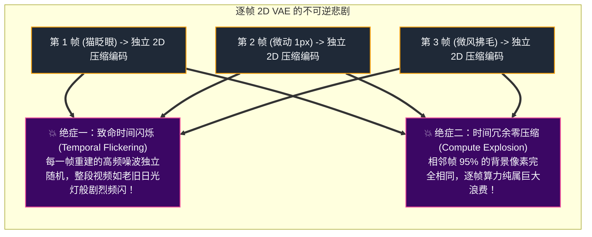
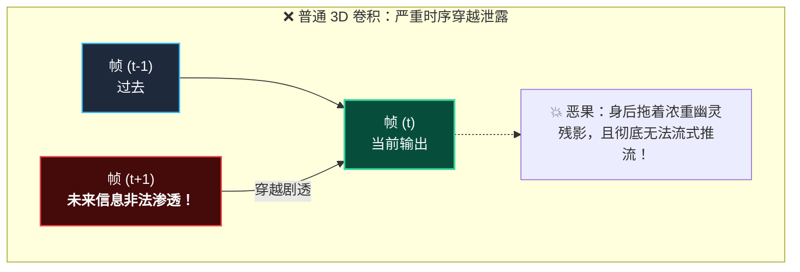
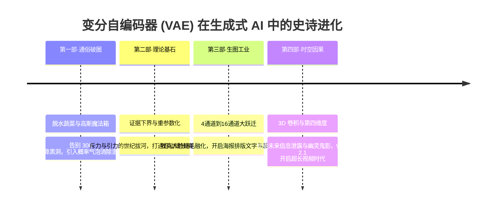

# 穿越第四维度：Sora、Wan 2.1 与 Cosmos 背后的 3D 因果视频 VAE（Causal Video VAE）架构

在前面三篇里，我们从生活通俗比喻、严密数学推导，一路杀到了 Stable Diffusion 和 Flux.1 的现代图像潜空间实战。

如果说 2D 图像生成是在一张平面白纸上挥毫泼墨，那么随着 **OpenAI Sora、阿里万象 Wan 2.1、NVIDIA Cosmos、腾讯混元 HunyuanVideo 以及智谱 CogVideoX** 的接连爆发，生成式人工智能正式吹响了**进军第四维度——“时间轴（Time Axis）”的冲锋号**。

2024 年初 Sora 的预告大片横空出世时，整个技术圈几乎通宵达旦地分析复盘；而到了 2025 年初阿里万象 Wan 2.1 正式宣布开源，全球开发者把权重 pull 下来跑通的那一刻，开源社区更是彻底炸锅了。

很多刚接触视频生成的初学者，往往会本能地冒出一个极其自然的想法：  
*“视频不就是一秒钟放 24 张连环画吗？把前面讲的 2D VAE 拿过来，一帧一帧地压成小魔方，再丢给 DiT 算时序注意力，不就大功告成了吗？”*

但凡在工业一线真正踩过坑的算法工程师，听到这话都会忍不住露出一抹意味深长的苦笑：  
**“兄弟，如果你真敢按‘连环画’的思路去跑视频，你当场就能见识到什么叫生成式 AI 的恐怖车祸现场！”**

今天，作为全专栏的终极收官之作，咱们就一起杀入当下最火爆的时空视频生成最前线！揭秘为什么必须有时空联合压缩、为什么 3D 卷积必须严守物理世界的“因果律（Causality）”，以及阿里 Wan 2.1 凭什么用仅仅 127M 参数的小巧身段，就在消费级显卡上颠覆了长视频生成的工业游戏规则！

---

## 1. 第四维度的维数灾难：为什么逐帧跑 2D VAE 会当场翻车？

首先，让我们算一笔让人不寒而栗的“算力与显存账本”。

一段普通的 1080P、24 帧/秒、时长仅仅 5 秒钟的短视频：
$$\text{总帧数} = 5 \times 24 = 120 \text{ 帧}$$
未压缩的单精度浮点（FP32）原始张量尺寸为：
$$120 \times 1080 \times 1920 \times 3 \times 4 \text{ 字节} \approx \mathbf{2.98 \text{ GB！}}$$

仅仅 5 秒钟的原生像素，就要霸占近 3GB 的显存；如果是长达几分钟的商业短片，任何数据中心的一张 H100/A100 显卡都会在第一秒被撑爆！


### 连环画方案（逐帧 2D VAE）的两大致命绝症

为了省事，早期的一些视频模型曾尝试直接用 2D VAE 逐帧编码：



> [!CAUTION]
> **连环画的频闪噩梦**  
> 因为 2D VAE 在压缩和解压单张图时，其高频重建的细微误差在空间上是随机波动的。当每秒 24 张“误差波动方向完全不同”的图片快速连续播放时，人眼看到的绝不是平滑运动，而是**地毯、墙壁和背景每一毫秒都在高频抽搐、水波状剧烈抖动（Flickering）**！  
> **视频生成的本质是连续时空流形，时间轴绝不能被割裂对待！**

---

## 2. 3D 时空联合压缩：打造时空晶体魔方

既然时间轴不能割裂，唯一的出路就是：**将空间（高度 $H$、宽度 $W$）与时间（帧数 $T$）捆绑在一起，送入 3D 卷积神经网络进行时空三维联合压缩！**

在现代视频大模型中，潜空间张量从原先的三维 $(C, H, W)$ 进化为四维时空立方体：
$$Z \in \mathbb{R}^{B \times C_{\text{latent}} \times \mathbf{T'} \times \mathbf{H'} \times \mathbf{W'}}$$

### 空间与时间的双重压缩比
以主流架构为例：
1. **空间下采样（Spatial Downsample）**：通常为 **8 倍**（$H' = H/8, W' = W/8$），将像素面积压缩 64 倍；
2. **时间下采样（Temporal Downsample）**：通常为 **4 倍**（Wan 2.1、HunyuanVideo）或 **8 倍**（CogVideoX）。也就是说，原本连贯的 16 帧原始视频，在潜空间中被凝聚成了 4 个（或 2 个）信息密度极高的“时空潜变量切片”！

原本 3GB 的庞然大物，瞬间被压缩成几十兆的小巧晶体，DiT 扩散中枢终于可以在这个紧凑的时空立方体里，高效计算注意力时空关联！

---

## 3. 因果 3D 卷积（Causal 3D Conv）：严禁剧透的时间单行道

然而，当我们把 2D 卷积升级为 3D 卷积时，一个更致命的物理幽灵浮出了水面：**时序泄露（Temporal Information Leakage）**！

### 普通 3D 卷积的“未来信息穿越剧透”
在深度学习中，标准的 3D 卷积核在时间轴上的尺寸通常为 $3$（时间感受野涵盖 $t-1, t, t+1$）。  
为了保证特征图尺寸对齐，标准操作是在两端**对称补零（Symmetric Padding）**。

这意味着什么？
当卷积核正在计算**第 $t$ 帧**的潜特征时，它的感受野里不仅包含了过去（$t-1$），**还赫然包含了未来的第 $t+1$ 帧！**



> [!WARNING]
> **剧透造成的两大灾难**
> 1. **运动鬼影（Ghosting Artifacts）**：一个人在屏幕上向右挥手，因为当前帧被未来一帧的信息提前污染，手还没有挥过去，半空中就已经隐隐约约浮现出手掌的半透明虚影！
> 2. **判了流式实时生成的“死刑”**：如果你想做一个实时互动的 AI 视频生成器（像直播一样源源不断吐出后续画面），在生成当前秒数时，下一秒的内容根本还没被创造出来，普通 3D 卷积当场因缺失未来输入而崩溃！

### 解决方案：因果卷积（Causal Convolution）与单向填充
因果卷积的核心思想，就是严格遵循物理世界的单向时间之箭：
**“下一秒发生什么，当前一秒绝不可知！”**

```mermaid
flowchart LR
    classDef past fill:#1e293b,stroke:#38bdf8,stroke-width:1.5px,color:#f8fafc;
    classDef curr fill:#064e3b,stroke:#34d399,stroke-width:2px,color:#f8fafc;
    classDef future fill:#1e293b,stroke:#64748b,stroke-width:1px,color:#64748b;

    subgraph Causal["✔ 因果 3D 卷积：时间单行道"]
        direction LR
        Pad["Causal Padding<br/>在时间轴最左端补 2 帧历史"]:::past
        P2["帧 (t-1)<br/>历史记忆"]:::past
        C2["帧 (t)<br/>当前输出"]:::curr
        F2["帧 (t+1)<br/>未知的未来 (安全屏蔽)"]:::future

        Pad --> P2 --> C2
        F2 -. "严密物理隔离" .x C2
        C2 ==> Pure["✨ 画面清爽纯净、动作干脆、原生支持无限长流式生成！"]
    end
```

在工程实现中，因果 3D 卷积采用**因果填充（Causal Padding）**：
不在两端对称补零，而是将原本要补在右边（未来）的 Padding，全部强制挪到左边（过去）！  
卷积核的时间感受野永远向后看，每一帧输出纯粹由历史沉淀而来！

---

## 4. 2025 开源之光巅峰拆解：阿里 Wan 2.1、Cosmos 与 Hunyuan

在过去的一年里，全球顶尖实验室针对视频 VAE 展开了激烈的军备竞赛。其中最耀眼的代表作当属 **阿里万象 Wan 2.1 的 Wan-VAE**、**NVIDIA Cosmos Tokenizer** 以及 **腾讯混元 HunyuanVideo**。

下面我们重点剖析在开源社区引起巨大轰动的 **Wan 2.1 3D Causal VAE**！

| 关键技术指标 | 阿里万象 Wan 2.1 (Wan-VAE) | NVIDIA Cosmos Tokenizer | 腾讯混元 HunyuanVideo | 智谱 CogVideoX |
| :--- | :--- | :--- | :--- | :--- |
| **模型参数量** | **约 127M（极致轻量）** | 约 150M ~ 300M | 约 200M+ | 约 180M |
| **潜变量通道数** | **16 通道** | 16 通道 (连续模式) | 16 通道 | 16 通道 |
| **时空下采样比** | **时间 4x / 空间 8x** | 时间 4x / 空间 8x 或 16x | 时间 4x / 空间 16x | **时间 8x / 空间 8x** |
| **下采样核心技术** | 3D 因果卷积 + RMSNorm | **双层 Haar 小波变换** | 3D 因果卷积 + Causal Pad | 3D 变分时空卷积 |
| **低显存优化神技** | **Feature-Cache（特征缓存）** | 长度解耦分块 | 滑动因果缓存 | 时空重叠分块 |
| **最低推理门槛** | **4GB ~ 8GB 消费级显卡** | 8GB+ | 12GB+ | 12GB+ |

---

### 阿里 Wan 2.1 的两大独门神功

在 Wan 2.1 的官方技术报告中，Wan-VAE 的设计堪称工业级工程智慧的典范，其中两项创新尤为惊艳：

#### 神技一：2D-to-3D 膨胀预训练（2D-to-3D Inflation）
设想一下，如果你想从零训练一个 3D 视频 VAE，就好比要教一个三岁小孩从零画出一部迪士尼动画电影：  
你得先教他画点、画线、画静物、画光影，再教他画动作连续性……这不仅需要动用几千张昂贵的计算卡日夜狂奔，而且稍微一个梯度震荡，几百万元的算力成本可能就打了水漂。

阿里的算法工程师们在这里打了一手极其聪明的小算盘——**“借鸡生蛋”**：
1. 业界的 2D 图像 VAE 已经在几十亿张高清写实大图上千锤百炼，对发丝、质感、色彩的压缩早已登峰造极；
2. 既然如此，何必从零受罪？他们直接把这个武功盖世的“2D 画画大师”请来，将成熟的 2D 卷积核权重，直接平移贴在 3D 卷积核正中央的“时间中心帧”上，而前后的时序权重全部赋 0 初始化；
3. 接着，给大师戴上一副 3D 眼镜，稍微带薪培训一下：“师傅，静态画面您已经是天花板了，接下来咱们只学一件事——**如何把前一帧的动作丝滑过渡到当前帧**！”

**这一手漂亮的“时空膨胀借力”，不仅完美继承了 2D 时代的巅峰单帧画质，还给团队省下了成百上千万的训练电费，堪称工业工程的精算典范！**

#### 神技二：Feature-Cache（特征缓存备忘录机制）
当你想在消费级显卡上生成 1080P、长达十几秒的超长视频时，哪怕压缩了 4 倍时间，一次性把所有帧解码依然会导致显存爆炸。

传统做法是按时间切片，一段一段算；但切片之间如果没有沟通，拼接处就会出现人物瞬移或色差。

Wan 2.1 的解法优雅至极：
- 因为因果卷积只依赖过去的特征，模型在解码第 $0 \sim 4$ 秒时，把网络深层最后几层的因果特征悄悄保存到一个轻量的 **Feature-Cache（特征缓存区）** 中；
- 当开始解码第 $5 \sim 8$ 秒时，直接读取缓存作为历史输入！
- **显存占用永远只停留在小切片的固定上限，而时间维度的上下文信息却能如江河流水般无限向前延伸！**

---

## 5. 显存自救：Temporal Sliding Window（时序滑动窗口）

在生产环境中，如果你要将一个包含上百帧的高清潜张量解码回视频，除了利用 Wan 2.1 类似的原生缓存，通用的工程最佳实践是采用 **时序滑动窗口与重叠混合（Temporal Sliding Window Blending）**：

```python
def decode_video_in_chunks(vae, latents, chunk_size=8, overlap=2, temporal_scale=4):
    """
    通用工业级长视频 VAE 分块平滑解码
    latents shape: (1, 16, T_latent, H_latent, W_latent)
    chunk_size: 每次送入 VAE 解码的时序潜变量窗口切片大小 (以潜空间帧计)
    overlap: 前后切片重叠的潜变量帧数 (以潜空间帧计)
    temporal_scale: VAE 时间上采样倍率 (例如 Wan 2.1 为 4 倍，将 1 帧潜变量还原为 4 帧像素)
    """
    B, C, T_latent, H_l, W_l = latents.shape
    decoded_frames = []
    
    # 转换为像素维度的重叠帧数: overlap * temporal_scale (例如 2 * 4 = 8 帧)
    pixel_overlap = overlap * temporal_scale
    
    start = 0
    while start < T_latent:
        end = min(start + chunk_size, T_latent)
        sub_latent = latents[:, :, start:end, :, :]
        
        # 局部轻量 VAE 解码: 输出形状 (B, 3, T_pixel, H_pixel, W_pixel)
        sub_video = vae.decode(sub_latent) 
        
        if start == 0:
            decoded_frames.append(sub_video)
        else:
            # 在像素空间的重叠时间窗口执行线性渐变混合 (Temporal Linear Blend)，消除分块边界跳跃
            prev_tail = decoded_frames[-1][:, :, -pixel_overlap:, :, :]
            curr_head = sub_video[:, :, :pixel_overlap, :, :]
            
            weight = torch.linspace(0, 1, steps=pixel_overlap).view(1, 1, pixel_overlap, 1, 1).to(latents.device)
            blended = (1 - weight) * prev_tail + weight * curr_head
            
            # 更新前一段末尾，并无缝拼接新一段的非重叠部分
            decoded_frames[-1][:, :, -pixel_overlap:, :, :] = blended
            decoded_frames.append(sub_video[:, :, pixel_overlap:, :, :])
            
        start += (chunk_size - overlap)
        
    return torch.cat(decoded_frames, dim=2)
```

通过严格区分**潜空间切片重叠**与**像素空间帧级融合（乘上时序上采样因子 `temporal_scale`）**，拼接缝隙被完全消除，且无论视频多长，解码显存始终锁定在轻量切片的固定水位线！

---

## 6. 全专栏终极总结：潜空间——生成式 AI 的引力场

恭喜你！读到这里，你已经伴随本专栏完整走过了生成式 AI 潜空间演进的全景征程。让我们站在山顶，回望这幅波澜壮阔的画卷：



在 AI 的宇宙里，如果说 Transformer 和 DiT 是光芒万丈、负责思考与推演的恒星；  
那么 **VAE 就是默默提供引力场、维持空间连续性、折叠降维时空的隐形暗物质**。

只有真正理解了潜空间里每一个通道的呼吸、每一个因果卷积核在时间轴上的流转，你才能在这场奔涌而来的多模态生成浪潮中，洞悉模型运作的终极本质，从容驾驭未来的技术之巅！
